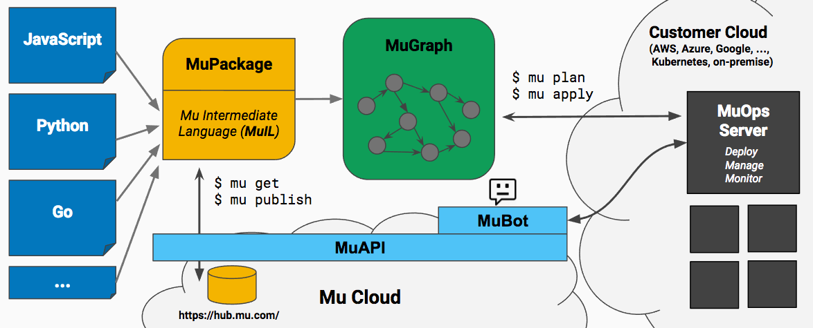

# Coconut

Coconut is a framework and toolset for creating reusable stacks of services.

If you are learning about Coconut for the first time, please see [the overview document](docs/overview.md).

## Architecture

## Prerequisites

Coconut is written in Go and uses Glide for dependency management.  They must be installed:

* [Go](https://golang.org/doc/install)
* [Glide](https://github.com/Masterminds/glide)

If you wish to use the optional `lint` make target, you'll also need to install Golint:

* `go get -u github.com/golang/lint/golint`

## Building and Testing

To build Coconut, first clone it into a standard Go workspace:

    $ mkdir -p $GOPATH/src/github.com/pulumi
    $ git clone git@github.com:pulumi/coconut $GOPATH/src/github.com/pulumi/coconut

A good default value for `GOPATH` is `~/go`.

Coconut needs to know where to look for its runtime, library, etc.  By default, it will look in `/usr/local/coconut`,
however you can override this with the `COCOPATH` variable.  Normally it's easiest just to create a symlink:

    $ ln -s $GOPATH/src/github.com/pulumi/coconut /usr/local/coconut

There is one additional build-time dependency, `golint`, which can be installed using:

    $ go get -u github.com/golang/lint/golint

And placed on your path by:

    $ export PATH=$PATH:$GOPATH/bin

At this point you should be able to build and run tests from the root directory:

    $ cd $GOPATH/src/github.com/pulumi/coconut
    $ glide update
    $ make

This installs the `coco` binary into `$GOPATH/bin`, which may now be run provided `make` exited successfully.

## Compilers

The Coconut compilers are built and tested independently from `coco` and its runtime written in Go.  Please see
the respective pages for details on this process for each compiler:

* [CoconutJS](tools/cocojs/README.md)

## Debugging

The Coconut tools have extensive logging built in.  In fact, we encourage liberal logging in new code, and addding new
logging when debugging problems.  This helps to ensure future debugging endeavors benefit from your sleuthing.

All logging is done using Google's [Glog library](https://github.com/golang/glog).  It is relatively barebones, and adds
basic leveled logging, stack dumping, and other capabilities beyond what Go's built-in logging routines offer.

The Coconut command line has two flags that control this logging and that can come in handy when debugging problems.  The
`--logtostderr` flag spews directly to stderr, rather than the default of logging to files in your temp directory.  And
the `--verbose=n` flag (`-v=n` for short) sets the logging level to `n`.  Anything greater than 3 is reserved for
debug-level logging, greater than 5 is going to be quite verbose, and anything beyond 7 is extremely noisy.

For example, the command

    $ coco eval Cocopack.yaml --logtostderr -v=5

is a pretty standard starting point during debugging that will show a fairly comprehensive trace log of a compilation.

