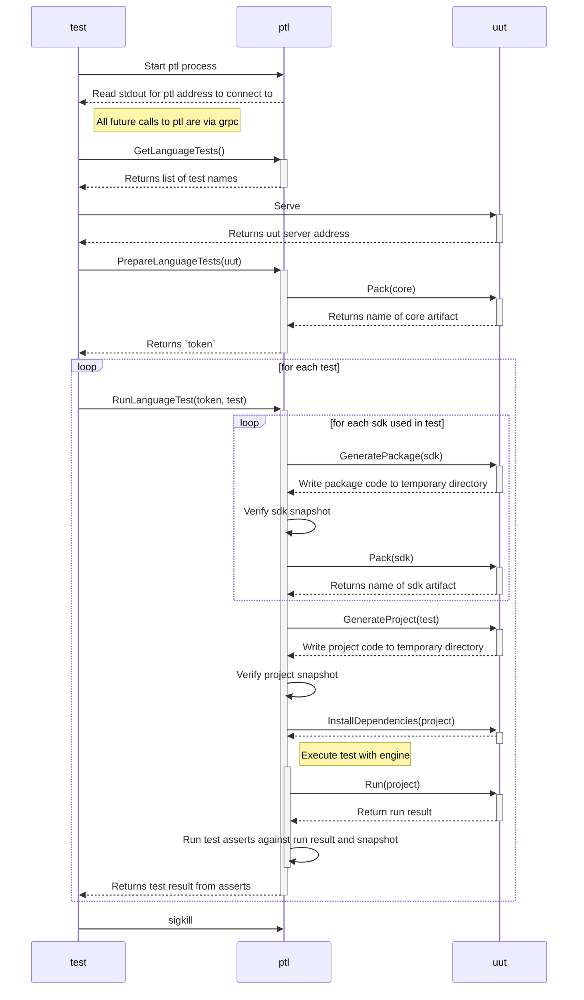

pulumi-language-test runs a gRPC interface that language plugins can use to run a suite of standard tests.

# Architecture

pulumi-language-test is used to run a standard suite of tests against 
any compliant language plugin.

The diagram below shows the main interactions and data flows for how this system works.

There are three main actors involved. Firstly `test` which is a test function coordinating the language plugin and pulumi-language-test. Secondly `ptl` which is the pulumi-language-test process. Finally `uut` which is the language plugin actually being tested. This will generally be a grpc server running in the same process as the test method.

## Meta tests

This module contains a number of `_test.go` files. These are tests of the conformance test system itself. The actual conformance tests are all defined in `tests.go`. 