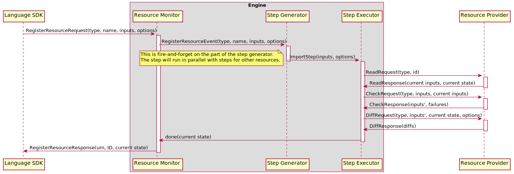

# Importing Resources

There are a variety of scenarios that require the ability for users to import existing
resources for management by Pulumi. For example:

- Migrating from manually-managed resources to IaC
- Migrating from other IaC platforms to Pulumi
- Migrating resources between Pulumi stacks

At a minimum, importing a resource involves adding the resource's state to the destination
stack's statefile. Once the resource has been added to the stack, the Pulumi CLI is able
to manage the resource like any other. In order to do anything besides delete the resource,
however, the user must also add a definition for the resource to their Pulumi program.

Both of the import approaches used by Pulumi aim to prevent the accidental modification or
deletion of a resource being imported. Though the user experiences of these approaches are
quite different, they share a common principle: at the point at which a resource is
successfully imported, the stack's Pulumi program must contain a definition for the
resource that accurately describes its current state (i.e. there are no differences
between the state described in the program and the actual state of the imported resource).

## `import` resource option

The oldest method supported of importing resources into a stack is the [`import`](https://www.pulumi.com/docs/intro/concepts/resources/#import)
[resource option](https://www.pulumi.com/docs/intro/concepts/resources/#options). When set,
this option specifies the ID of an existing resource to import into the stack. The exact
behavior of this option depends on the current state of the resource within the destination
stack:

1. If the resource does not exist, it is imported
2. If the resource exists and has the same `ID` or `ImportID`, the resource is treated
   like any other resource
3. Otherwise, the current resource is deleted and replaced by importing the resource with
   the specified ID

The trickiest of these three situations is (2). This state transition is intended to allow
users to import a resource and then continue to make changes to their program without
requiring that they remove the resource option. For example, this allows a user to import
a resource in one `pulumi up`, then successfully run another `pulumi up` without removing
the `import` option from their program and without attempting to import the resource a
second time.

As mentioned in [the introduction](#importing-resources), the `import` resource option
requires that the desired state described by Pulumi program for a resource being imported
matches the actual state of the resource as returned by the provider. More precisely,
given a resource `R` of type `T` with  import ID `X` and the resource inputs present in the
Pulumi program `Iₚ`, the engine performs the following sequence of operations:

1. Fetch the current inputs `Iₐ` and state `Sₐ` for the resource of type `T` with ID `X`
   from its provider by calling the provider's [`Read` method](providers/implementers-guide.md#read).
   If the provider does not return a value for `Iₐ`, the provider does not support
   importing resources and the import fails.
2. Process the [`ignoreChanges` resource option](https://www.pulumi.com/docs/intro/concepts/resources/#import)
   by copying the value for any ignored input property from `Iₐ` to `Iₚ`.
3. Validate the resource's inputs and apply any programmatic defaults by passing `Iₚ` and
   `Iₐ` to the provider's [`Check` method](providers/implementers-guide.md#check). Let
   `Iₖ` be the checked inputs; these inputs form the resource's desired state.
4. Check for differences between `Iₖ` and `Sₐ` by calling the provider's [`Diff` method](providers/implementers-guide.md#diff).
   If the provider reports any differences, the import either succeeds with a warning (in
   the case of a preview) or fails with an error (in the case of an update).

If all of these steps succeed, the user is left with a definition for `R` in their Pulumi
program and the statefile of the updated stack that do not differ.

### Technical Note

Although the "no diffs" requirement is intended to prevent surprise, it also accommodates
a technical limitation of the Pulumi engine. In order to actually perform the diff--an
operation that is required whether or not the user is permitted to describe a desired
state for the imported resource that differs from its actual state--the engine must fetch
the resource's current imports and state from its provider. In order for this state to
affect the steps the engine issues for the resources, the state would need to be fetched
during or prior to the point at which the resource's registration reaches the [step
generator](resource-registration.md#the-step-generator). In the former case, this would
cause the engine to spend an unacceptable amount of time in the step generator, as it
processes resource registrations serially. In the latter case, the user experience would
likely be negatively affected by a lack of output from the Pulumi CLI, which only displays
the status of [steps](resource-registration.md#the-step-generator). In order to address
these issues, the operations described above happen in a dedicated `ImportStep` that is
run by the [step executor](resource-registration.md#the-step-executor).

## `pulumi import`

The second, newer method of importing resources into a stack is the [`pulumi import`
command](https://www.pulumi.com/docs/cli/commands/pulumi_import/). This command accepts a
list of import specs to import, imports the resources into the destination stack, and
generates definitions for the resources in the language used by the stack's Pulumi program.
Each import spec is at least a type token, name, and ID, but may also specify a parent URN,
provider reference, and package version.

During a `pulumi import`, given a resource `R` of type `T` with import ID X and an empty
set of input properties `Iₚ`, the engine performs the following sequence of operations:

1. Fetch the current inputs `Iₐ` and state `Sₐ` for the resource of type `T` with ID `X`
   from its provider by calling the provider's [`Read` method](providers/implementers-guide.md#read).
   If the provider does not return a value for `Iₐ`, the provider does not support
   importing resources and the import fails.
2. Fetch the schema for resources of type `T` from the provider. If the provider is not
   schematized or if `T` has no schema, the import fails.
3. Copy the value of each required input property defined in the schema for `T` from `Iₐ`
   to `Iₚ`.
4. Validate the resource's inputs and apply any programmatic defaults by passing `Iₚ` and
   `Iₐ` to the provider's [`Check` method](providers/implementers-guide.md#check). Let
   `Iₖ` be the checked inputs; these inputs form the resource's desired state.
5. Check for differences between `Iₖ` and `Sₐ` by calling the provider's [`Diff` method](providers/implementers-guide.md#diff).
   If the provider reports any differences, the values of the differing properties are
   copied from `Sₐ` to `Iₚ`. This is intended to produce the smallest valid set of inputs
   necessary to avoid diffs. This does not use a fixed-point algorithm because there is no
   guarantee that the values copied from `Sₐ` are in fact valid (state and inputs with the
   same property paths may have different types and validation rules) and there is no
   guarantee that such an algorithm would terminate (TF bridge providers have had bugs that
   cause persistent diffs, which can only be worked around with `ignoreChanges`).

If all of these steps succeed, the user is left with a definition for `R` in the statefile
of the updated stack that do not differ. The Pulumi CLI then passes the inputs `Iₚ` stored
in the statefile to the import code generator. The import code generator converts the values
present in `Iₚ` into an equivalent PCL representation of `R`'s desired state, then passes
the PCL to a language-specific code generator to emit a representation of `R`'s desired
state in the language used by the destination stack's Pulumi program. The user can then
copy the generated definition into their Pulumi program.

Graphically, the import process looks something like this:

### Challenges

The primary challenge in generating appropriate code for `pulumi import` lies in
determining exactly what the input values for a particular resource should be. In many
providers, it is not necessarily possible to accurately recover a resource's inputs from
its state. This observation led to the diff-oriented approach described above, where the
importer begins with an extremely minimal set of inputs and attempts to derive the actual
inputs from the results of a call to the provider's [`Diff` method](providers/implementers-guide.md#diff).
Unfortunately, the results are not always satisfactory, and the relatively small set of
inputs present in the generated code can make it difficult for users to determine what
inputs they _actually_ need to pass to the resource to describe its current state.

A few other approaches might be:

- Emit no properties at all; just appropriate constructor calls. This will almost always
  emit code that does not compile or run, as nearly every resource has at least one
  required property.
- Copy the value for every input property present in a resource's schema from its state.
  This risks emitting code that does not compile due to differences in types between
  inputs and outputs, and also risks emitting code that does not work at runtime due to
  conflicts between mutually-exclusive properties (these are common for TF-based
  resources, for example).

It is likely that some mix of approaches is necessary in order to arrive at a satisfactory
solution, as none of the above solutions seems universally "correct".
