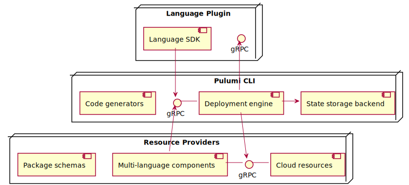

# Pulumi Architecture Overview

Broadly speaking, Pulumi is composed of five components:

1. [The deployment engine](#the-deployment-engine)
2. [State storage backends](#state-storage-backends)
3. [Language SDKs](#language-sdks)
4. [Resource providers](#resource-providers)
5. [Package schemas and code generators](#package-schemas-and-code-generators)

These components interact to provide the feature set exposed by the Pulumi CLI and SDKs, including desired-state
deployments using standard programming languages, remote state storage and secret encryption, and the ability to bridge
the gap between existing and Pulumi-managed infrastructure.

These components are composed like so:

In most cases, the language plugin, CLI, and resource providers will all live in separate processes, and each instance
of a resource provider will live in its own process.

## The Deployment Engine

## State Storage Backends

## Language SDKs

## Resource Providers

## Package Schemas and Code Generators
