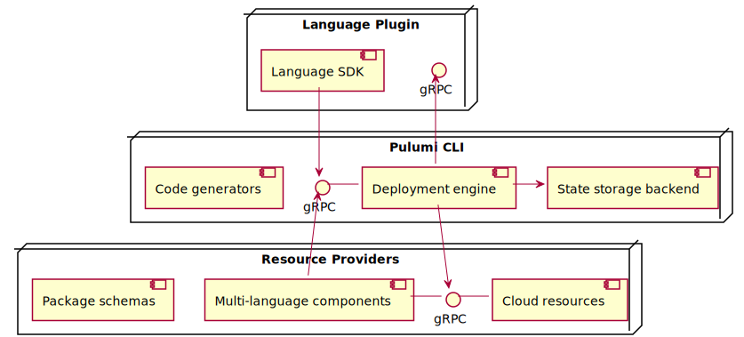

# Pulumi Architecture Overview

Broadly speaking, Pulumi is composed of five components:

1. [The deployment engine](#the-deployment-engine)
2. [State storage backends](#state-storage-backends)
3. [Language SDKs](#language-sdks)
4. [Resource providers](#resource-providers)
5. [Package schemas and code generators](#package-schemas-and-code-generators)

These components interact to provide the feature set exposed by the Pulumi CLI and SDKs, including desired-state
deployments using standard programming languages, remote state storage and secret encryption, and the ability to bridge
the gap between existing and Pulumi-managed infrastructure.

These components are composed like so:

In most cases, the language plugin, CLI, and resource providers will all live in separate processes, and each instance
of a resource provider will live in its own process.

## The Deployment Engine

The deployment engine lives in `pkg/engine/` and orchestrates resource deployments. It implements the core
lifecycle operations (create, update, delete, import, refresh) by comparing desired state (from a Pulumi program)
against actual state (from the state backend). The engine communicates with language hosts and resource providers
via gRPC, with protocol definitions in `proto/`.

Key subdirectories:
- `pkg/engine/` — deployment orchestration, step generation, execution
- `pkg/engine/lifecycletest/` — extensive lifecycle fuzz tests
- `pkg/resource/` — resource types, URNs, property values, diffs
- `pkg/resource/deploy/` — deployment planning and execution

## State Storage Backends

State backends store and retrieve deployment state (the snapshot of all managed resources). Implementations
live in `pkg/backend/`:
- `pkg/backend/diy/` — local filesystem and cloud object storage (S3, GCS, Azure Blob)
- `pkg/backend/httpstate/` — Pulumi Cloud service backend
- `pkg/backend/display/` — deployment progress display (terminal UI, JSON, WASM)

## Language SDKs

Each supported language has an SDK and a language host (a gRPC server that the engine talks to):
- **Go:** SDK in `sdk/go/`, language host in `sdk/go/pulumi-language-go/`
- **Node.js:** SDK in `sdk/nodejs/`, language host in `sdk/nodejs/cmd/pulumi-language-nodejs/`
- **Python:** SDK in `sdk/python/`, language host in `sdk/python/cmd/pulumi-language-python/`
- **PCL** (Pulumi Configuration Language): runtime in `sdk/pcl/`

Language hosts implement the `LanguageRuntime` gRPC interface defined in `proto/pulumi/language.proto`.

## Resource Providers

Resource providers implement CRUD operations for cloud resources. They communicate with the engine via the
`ResourceProvider` gRPC interface defined in `proto/pulumi/provider.proto`. Provider-side logic in this repo
lives in `pkg/resource/provider/`. Most actual providers live in separate repos (e.g., `pulumi-aws`).

## Package Schemas and Code Generators

Package schemas (`pkg/codegen/schema/`) describe a provider's resources, functions, and types in a
language-neutral format. The metaschema is defined in `pkg/codegen/schema/pulumi.json`.

Code generators in `pkg/codegen/` produce language-specific SDKs from these schemas:
- `pkg/codegen/go/` — Go SDK generation
- `pkg/codegen/nodejs/` — Node.js/TypeScript SDK generation
- `pkg/codegen/python/` — Python SDK generation
- `pkg/codegen/dotnet/` — .NET SDK generation
- `pkg/codegen/pcl/` — PCL (intermediate representation, program conversion)
