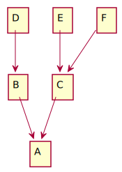
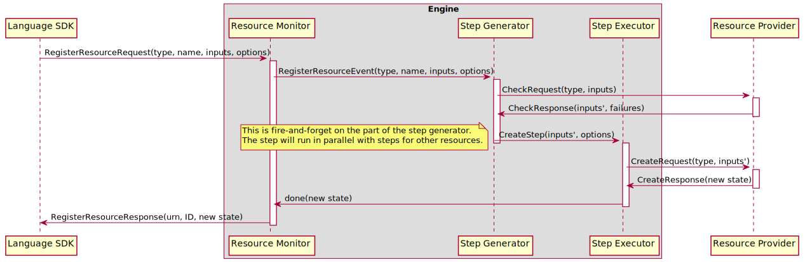
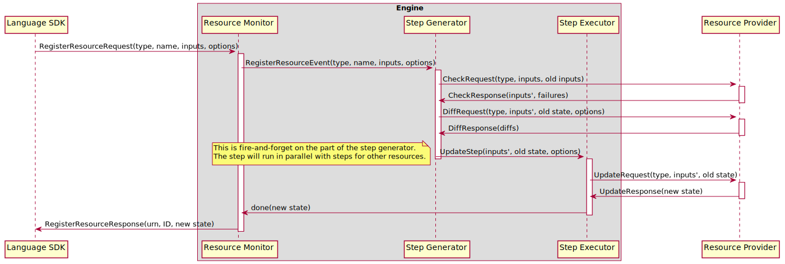
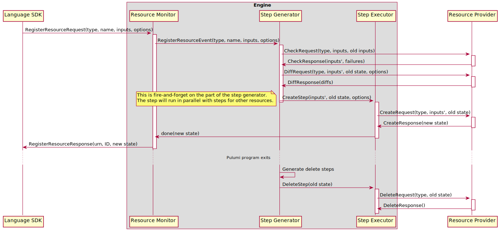
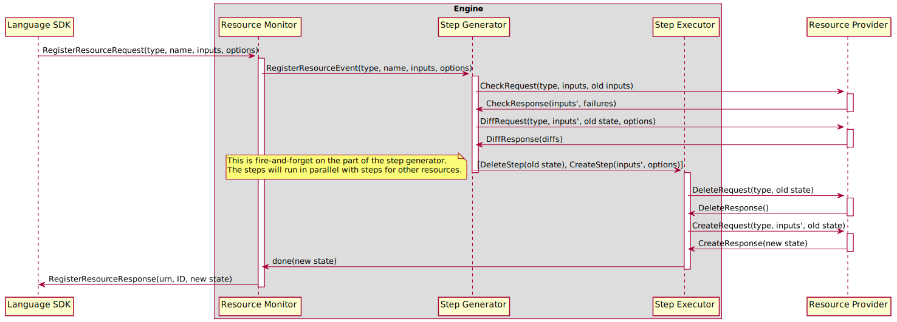
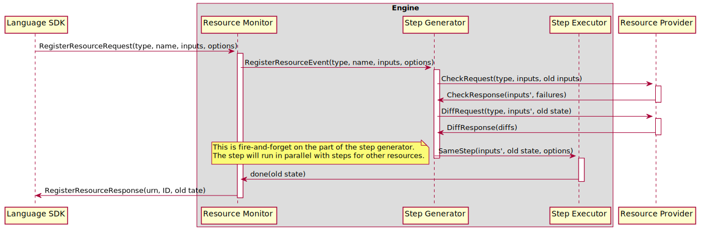
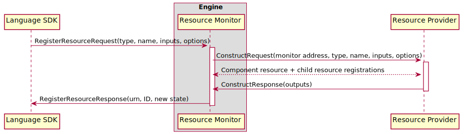

# Resource Registration

A Pulumi program declares the desired states of its stack's resources by sending `RegisterResource` requests to the
Pulumi engine. Each `RegisterResource` request contains the type, name, and parent (if any) of the resource, a
reference to the provider instance that manages the resource (where an empty reference indicates that the resource
uses the default provider instance for its package + version), the values of the resource's input properties, and
any options that apply to the resource. The engine decides what step to take in order to drive a resource to its
goal state by diffing the resource's current state as present in the statefile with its desired state. If there is
no current state, the resource is created. Otherwise, the engine calls the resource's provider's `Diff` method to
determine wither the resource is unchanged, updated, or replaced. Once the required action (or actions, in the case
of a replacement) has been determined, the engine calls the resource's provider's `Create`, `Update`, or `Delete`
methods to perform it. After the action completes, the engine returns the new state of the resource to the Pulumi
program.

Although we typically treat the engine as a single unit, in the case of resource registrations it helps to break it
down into a few of its internal components: the [resource monitor], the [step generator], and the [step executor]. Each
of these components is a participant in the response to a `RegisterResourceRequest`.

## The Resource Monitor

The _resource monitor_ provider serves the `ResourceMonitor` gRPC interface, and provides a shim between language SDKs
and the rest of the engine. There is a single resource monitor per deployment. As the engine's feature set has grown,
the resource monitor has taken on responsibilities beyond its original use as a simple marshaling/unmarshaling layer.
It is now responsible for handling default providers (providers for resource registrations that do not reference a
provider instance) and for dispatching `RegisterResourceRequest`s for multi-language components into appropriate
`Construct` calls.

When the resource monitor receives a resource registration, it does the following:

1. Unmarshals data from the gRPC wire format to the engine's internal representation.
2. If the registration request does not name a provider instance, handles the resolution of the resource's default
   provider.
3. If the request is for a multi-language component, dispatches a `Construct` call to the component's provider and
   waits for the result.
4. If the request is not for a multi-langauge component, sends a `RegisterResourceEvent` to the [step generator] and
   waits for the result.
5. Marshals the result of the `Construct` call or `RegisterResourceEvent` from the engine's internal representation
   to the gRPC wire format and returns from the RPC call.

### Default Providers

Default providers demand some amount of special attention. A _default provider_ for a package and version is the
provider instance that is used for resources at that package and version that do not otherwise reference a provider
instance when they are registered. For example, consider the following program that creates an AWS S3 bucket:

```typescript
import * as aws from "@pulumi/aws";

new aws.s3.Bucket("myBucket");
```

The constructor call will become a `RegisterResourceRequest` like:

```
RegisterResourceRequest{
	type: "aws:s3/bucket:Bucket",
	name: "myBucket",
	parent: "urn:pulumi:dev::project::pulumi:pulumi:Stack::project",
	custom: true,
	object: {},
	version: "4.16.0",
}
```

Because this request does not contain a value for the `provider` field, it will use the default provider for the
`aws` package at version 4.16.0. The resource monitor ensures that only a single default provider instance exists
for each particular package version, and only creates default provider instances if they are needed. Default provider
instances are registered by synthesizing an appropriate `RegisterResourceEvent` with input properties sourced from the
stack's configuration values for the provider's package. In the example above, the AWS default provider would be
configured using any stack configuration values whose keys begin with `aws:` (e.g. `aws:region`).

If we change the program slightly to create and reference a provider instance, the default provider will no longer
be used:

```typescript
import * as aws from "@pulumi/aws";

const usWest2 = new aws.Provider("us-west-2", {region: "us-west-2"});

new aws.s3.Bucket("myBucket", {}, {provider: usWest2});
```

The constructor call will become a `RegisterResourceRequest` like:

```
RegisterResourceRequest{
	type: "aws:s3/bucket:Bucket",
	name: "myBucket",
	parent: "urn:pulumi:dev::project::pulumi:pulumi:Stack::project",
	custom: true,
	object: {},
	provider: "urn:pulumi:dev::vpc-2::pulumi:providers:aws::us-west-2::308b79ee-8249-40fb-a203-de190cb8faa8",
	version: "4.16.0",
}
```

Note that this request _does_ contain a value for the `provider` field.

## The Step Generator

The _step generator_ is responsible for processing `RegisterResourceEvent`s from the [resource monitor]. The generator
implements the core logic that determines which actions to take in order to drive the actual state of a resource to
its desired state as represented by the input properties in its `RegisterResourceEvent`. In order to simplify
reasoning about the actual state of a stack's resources, the step generator processes `RegisterResourceEvent`s
serially. It is important to note that this approach puts the step generator on a deployment's critical path, so
any significant blocking in the step generator may slow down deployments accordingly. In the case of updates, step
generator latency is generally insignificant compared to the time spent performing resource operations, but this is
not the case for updates where most resources are unchanged or for previews, which spend very little time in resource
providers in general.

When the step generator receives a `RegisterResourceEvent`, it does the following:

1. Generate a URN for the resource using the resource's type, name, and parent.
2. Look up the existing state for the resource, if any. If the event contains aliases for the resource, this includes
   checking for existing state under those aliases. It is an error if a resource's aliases match multiple existing
   states.
3. Pre-process input properties for ignored changes by setting any properties mentioned in the event's ignore changes
   list to their old value (if any)
4. If the event indicates that the resource should be imported, issue an `ImportStep` to the [step executor] and return.
5. Call the resource's provider's `Check` method with the event's input properties and the resource's existing inputs,
   if any. The existing inputs may be used by the provider to repopulate default values for input properties that are
   automatically generated when the resource is created but should not be changed with subsequent updates (e.g.
   automatically generated names). `Check` returns a pre-processed bag of input values to be used with later calls to
   `Diff`, `Create`, and `Update`.
6. Invoke any analyzers for the stack to perform additional validation of the resource's input properties.
7. If the resource has no existing state, it is being created. Issue a `CreateStep` to the [step executor] and return.
8. Diff the resource in order to determine whether it must be updated, replaced, delete-before-replaced, or has no
   changes. Diffing is covered in detail later on, but typically consists of calling the reosource's provider's
   `Diff` method with the checked inputs from step 5.
9. If the resource has no changes, issue a `SameStep` to the [step executor] and return.
10. If the resource is not being replaced, issue an `UpdateStep` to the [step executor] and return.
11. If the resource is being replaced, call the resource's provider's `Check` method again, but with no existing
    inputs. This call ensures that the input properties used to create the replacement resource do not reuse
    generated defaults from the existing resource.
12. If the replacement resource is being created before the original is deleted (a normal replacement), issue a
    `CreateStep` and a `DeleteStep` to the [step executor] and return.
13. At this point, the resource must be deleted before its replacement is created (this is the "delete-before-replace"
    case). Calculate the set of dependent resources that must be deleted prior to deleting the resource being replaced.
    The details of this calculation are covered in a later section. Once the set of deletions has been calculated,
    issue a sequence of `DeleteStep`s followed by a single `CreateStep` to the [step executor].

Note that all steps that are issued to the step generator are fire-and-forget. Once steps have been issues, the step
generator moves on to process the next `RegisterResourceEvent`. It is the responsibility of the [step executor] to
communicate the results of each step back to the [resource monitor].

Once the Pulumi program has exited, the step generator determines which existing resources must be deleted by taking
the difference between the set of registered resources and the set of existing resources. These resources are scheduled
for deletion by first sorting the list of resources to delete using the topological order of their reverse-dependency
grapth, then decomposing the list into a list of lists where each list can be executed in parallel but a previous list
must be executed to completion before advancing to the next list.

In lieu of tracking per-step dependencies and orienting the [step executor] around these dependencies, this approach
provides a conservative approximation of which deletions can safely occur in parallel. The insight here is that the
resource dependency graph is a partially-ordered set and all partially-ordered sets can be easily decomposed into
antichains--subsets of the set that are all not comparable to one another (in this definition, "not comparable"
means "do not depend on one another").

The algorithm for decomposing a poset into antichains is:

1. While there exist elements in the poset, \
	a. There must exist at least one "maximal" element of the poset. Let `E_max` be those elements. \
	b. Remove all elements E_max from the poset. `E_max` is an antichain. \
	c. Goto 1.

Translated to a resource dependency graph:

1. While the set of condemned resources is not empty: \
	a. Remove all resources with no outgoing edges from the graph and add them to the current antichain. \
	b. Goto 1.

The resulting list of antichains is a list of list of delete steps that can be safely executed in parallel. Since
deletes must be processed in reverse order (so that resources are not deleted prior to their dependents), the step
generator reverses the list and then issues each sublist to the [step executor].

### Resource Diffing

Although resource diffing is simple in most cases, there are several possibilities that the step generator must
consider as part of performing a diff. The algorithm for diffing a resource is outlined here.

1. If the resource has been marked for replacement out of band (e.g. by the use of the `--target-replace` command-line
   option of the Pulumi CLI), the resource must be replaced.
2. If the resource's provider has changed, the resource must be replaced. Default providers are allowed to change
   without requiring replacement if and only if the provider's configuration allows the new default provider to continue
   to manage existing resources (this is intended to allow default providers to be upgraded without requiring that
   all the resources they manage are replaced).
3. If the engine is configured to use pre-1.0-style diffs, compare the resource's old and new inputs. If the old and
   new inputs differ, the resource must be updated.
4. Otherwise, call the resource's provider's `Diff` method with the resource's new inputs, old state, and ignore changes
   set to determine whether the resource has changed, and if so, if it must be replaced.

Once the diff has been calculated, the step generator applies any replace-on-change options specified by the
resource. These options force a resource to require that it is replaced if any of a particular set of properties has
changed.

### Dependent Replacements

When a resource must be deleted before it is replaced--whether this is required by the resource's provider or is forced
using the `deleteBeforeReplace` resource option--it may be necessary to first delete dependent resources. The step
generator does this by taking the complete set of transitive dependents on the resource under consideration and
removing any resources that would not be replaced by changes to their dependencies. It determines whether or not a
resource must be replaced by substituting unknowns for any input properties that may change due to deletion of the
resources their value depends on and calling the resource's provider's `Diff` method.

This is perhaps clearer when described by example. Consider the following dependency graph:



In this graph, all of B, C, D, E, and F transitively depend on A. It may be the case, however, that changes to the
specific properties of any of those resources R that would occur if a resource on the path to A were deleted and
recreated may not cause R to be replaced. For example, the edge from B to A may be a simple `dependsOn` edge such that
a change to B does not actually influence any of B's input properties.  More commonly, the edge from B to A may be due
to a property from A being used as the input to a property of B that does not require B to be replaced upon a change.
In these cases, neither B nor D would need to be deleted before A could be deleted.

## The Step Executor

The _step executor_ is responsible for executing sequences of steps (called "chains") that perform the resource actions
for a deployment. These chains are issued by the [step generator], and most often consist of a single step. While the
steps the make up a chain must be performed serially, chains may be executed in parallel. The step executor uses a
(potentially infinite) pool of workers to execute steps. Once a step completes, the step executor communicates its
results to the [resource monitor] if necessary. If a step fails, the step executor notes the failure and cancels the
deployment. Once the Pulumi program has exited and the [step generator] has issued all required deletions, the step
executor waits for all outstanding steps to complete and then returns.

## Example Resource Registration Sequences

### Custom Resources

Each of the diagrams below demonstrates a sequence of events that occur when a custom resource is registered. Examples
are given for each possible action: create, update, replace, delete-before-replace, import, and no change.

#### Create


#### Update


#### Replace


#### Delete-before-replace


#### Import


#### No change


### Multi-language Components

The diagram below illustrates the sequence of events that occurs when a multi-language component is registered. The
registration of the component's children is elided.



[resource monitor]: #the-resource-monitor
[step generator]: #the-step-generator
[step executor]: #the-step-executor
