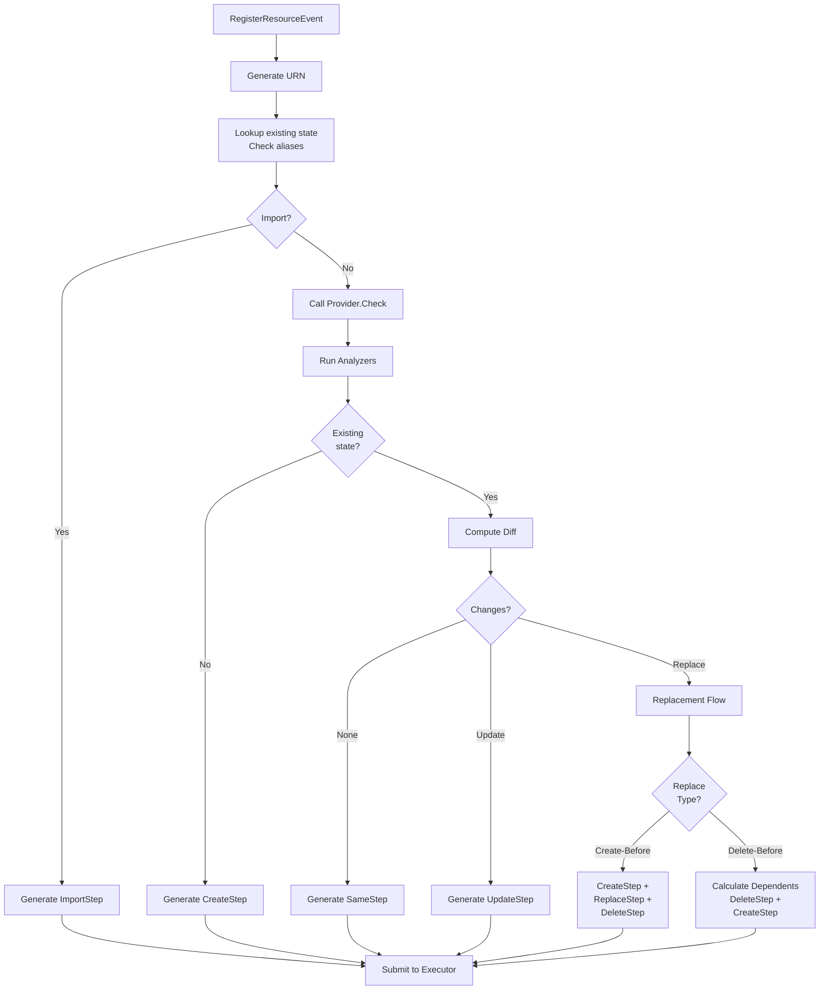
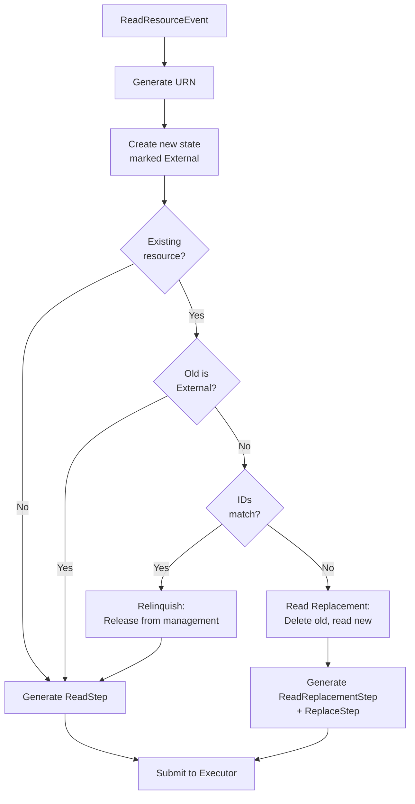
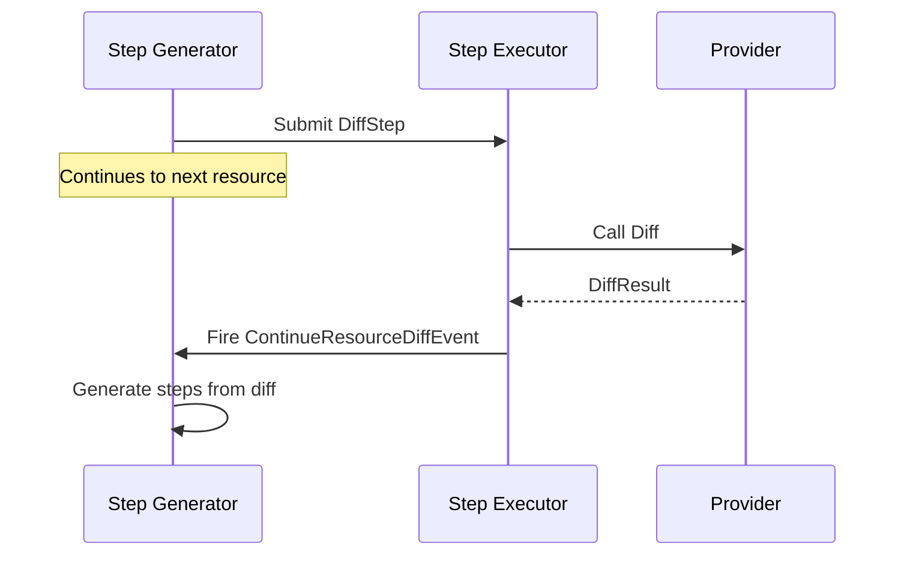
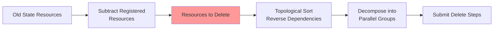
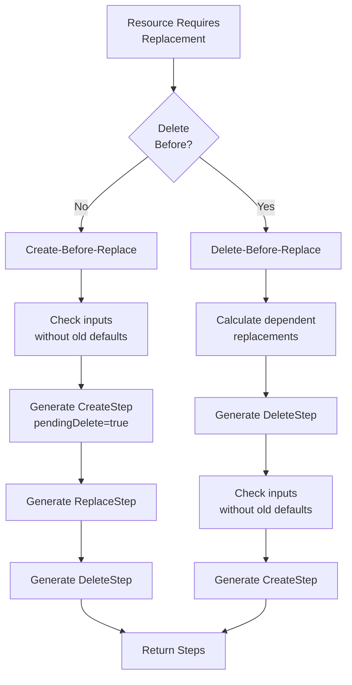
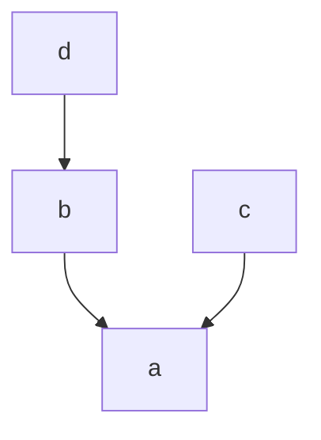
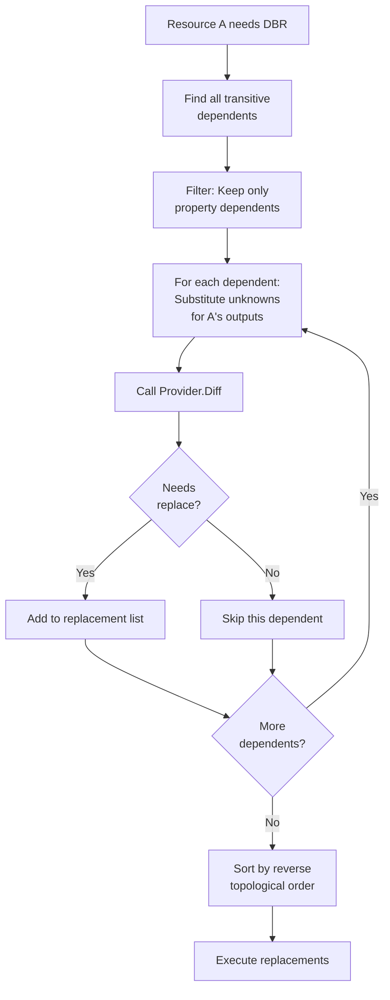

(resource-registration)=
# Resource registration

As a Pulumi program is executed by the language host, it will make
[](pulumirpc.ResourceMonitor.RegisterResource) calls to the engine in order to
declare resources and their desired state. Each
[](pulumirpc.RegisterResourceRequest) contains:

* The resource's type and name.
* The resource's [parent](https://www.pulumi.com/docs/concepts/options/parent/),
  if it has one.
* A reference to the
  [provider](https://www.pulumi.com/docs/concepts/resources/providers/) that
  manages the resource, if an explicit one has been specified. If no reference
  has been specified, Pulumi will use a [default provider](#default-providers)
  instance for the resource's package and version.
* Values for the resource's input properties.
* Any [resource options](https://www.pulumi.com/docs/concepts/options/) that
  have been specified for the resource.

In order to determine what actions to take in order to arrive at the desired,
the engine *diffs* the desired state of the resource against the current state
as recorded in the [state snapshot](state-snapshots):

* If there is no current state, the engine will attempt to create a new
  resource.
* If there is a current state, the engine will [diff](step-generation-diff) the
  current state with the desired state to determine whether the resource is
  unchanged, requires updating, or must be replaced in some manner.

When the appropriate actions have been determined, the engine will invoke the
relevant provider methods to carry them out. After the actions complete, the
engine returns the new state of the resource to the program.

Although all of the above happens "in the engine", in practice these concerns
are separated into a number of subsystems: the [resource
monitor](resource-monitor), the [step generator](step-generation), and the [step
executor](step-execution).

(resource-monitor)=
## Resource monitor

The *resource monitor* (largely represented by `resmon` in the codebase; see
<gh-file:pulumi#pkg/resource/deploy/source_eval.go>) implements the
[](pulumirpc.ResourceMonitor) interface, which is the primary communication
channel between language hosts and the engine. There is a single resource
monitor per deployment. Aside from being a marshalling and unmarshalling layer
between the engine and its gRPC boundary, the resource monitor is also
responsible for resolving [default providers](default-providers) and [component
providers](component-providers), responding to
[](pulumirpc.RegisterResourceRequest)s as follows:

* The request is unmarshalled from the gRPC wire format into an engine-internal
  representation.
* If the request lacks a `provider` reference, the resource monitor will resolve
  a [default provider](default-providers) for the resource's package and
  version.
* If the request registers a [remote component](component-providers), the
  resource monitor will dispatch an appropriate
  [](pulumirpc.ResourceProvider.Construct) call to the component provider and
  await the result.
* If the request does *not* register a remote component (a so-called *custom
  resource*, although this is in reality the default type of resource), the
  resource monitor will emit a `RegisterResourceEvent` and await a response.
* When a result is received (either in response to a
  [](pulumirpc.ResourceProvider.Construct) call or a `RegisterResourceEvent`),
  the resource monitor will marshal the result back into the gRPC wire format
  and return it to the language host.

(step-generation)=
## Step generation

The *step generator* (<gh-file:pulumi#pkg/resource/deploy/step_generator.go>)
converts `RegisterResourceEvents` and `ReadResourceEvents` from the Pulumi program
into executable [steps](steps).  Steps are the internal representation of
everything that needs to happen to fulfill the goals of that program. The steps
are passed to the step executor, which will do the actual work encoded in the
steps.

This is a fire and forget process. Once a step has been generated
the step generator immediately moves on to the next `RegisterResourceEvent`. It
is the responsibility of the [step executor](step-execution) to communicate the
results of each step back to the [resource monitor](resource-monitor).
executor to the step generator.

### Process Overview



### Step Generation Algorithm

When a `RegisterResourceEvent` is received:

1. URN Generation: Create URN from type, name, and parent
2. State Lookup: Find existing state by URN or aliases (error if multiple matches)
3. Import Check: If importing, generate `ImportStep` and return
4. Check Inputs: Call provider's `Check` to validate and normalize inputs
5. Run Analyzers: Execute configured analyzers for validation
6. Decision Point:
   - No existing state: Generate `CreateStep`
   - Has existing state: Proceed to diff
7. Diff: Compute differences between old and new state (can happen async, see below)
8. Generate Steps:
   - No changes: `SameStep`
   - Update: `UpdateStep`
   - Replace: Replacement flow (see below)

:::{note}
Presently, step generation is a *serial* process (that is, steps are processed
one at a time, in turn). This means that step generation is on the critical path
for a deployment, so any significant blocking operations could slow down
deployments considerably. In the case of an update, step generator latency is
generally insignificant compared to the time spend performing provider
operations (e.g. cloud updates), but in the case of a large preview operation,
or an update where most resources are unchanged, the step generator could become
a bottleneck.

There are some exceptions to this, e.g. with diffs (see below), but largely operations
that happen in the step generator should be fast, to not slow the whole deployment
down.
:::


### Read Resource Events

While `RegisterResourceEvent`s represent resources managed by Pulumi,
`ReadResourceEvent`s fetch existing resources as external references. These
resources are marked `External = true`, meaning Pulumi tracks them but doesn't
own their lifecycle.



1. Generate URN from type, name, and parent
2. Create state marked as `External = true` with provided ID
3. Check existing resource:
   - No existing: Simple `ReadStep` to fetch state
   - Existing external: Simple `ReadStep` (updating reference)
   - Existing managed, same ID: "Relinquish" - release from Pulumi
     management, generate `ReadStep`
   - Existing managed, different ID: "Read replacement" - generate
     `ReadReplacementStep` to delete old managed resource and `ReplaceStep`
     marker

(step-generation-diff)=
### Diffing

While in most cases diffing boils down to calling a provider's
[](pulumirpc.ResourceProvider.Diff) method, there are a number of cases where
this might not happen. The full algorithm that the engine currently implements
is as follows:

1. If the resource has been marked for replacement out-of-band (e.g. by the use
   of the `--target-replace` command-line option), the resource must be
   replaced.
2. If the resource's provider has changed, the resource must be replaced.
   [Default providers](default-providers) are allowed to change without
   triggering a replacement if and only if the provider's configuration allows
   the new default provider to continue to manage existing resources. This is
   intended to allow default providers to be upgraded without causing all
   resources they manage to be replaced.
3. If the engine is configured to use legacy (pre-1.0) diffs, the engine will
   compare old and new inputs itself (without consulting the provider). If these
   differ, the resource must be updated.
4. In all other cases, the engine will call the provider's
   [](pulumirpc.ResourceProvider.Diff) method to determine whether the resource
   must be updated, replaced, or left as-is.

#### Parallel Diff Optimization

To avoid blocking step generation, diffs can be computed in parallel using the
step executor's worker pool (note that this is disabled by default as of the time
of this writing, and can be enabled with the `PULUMI_PARALLEL_DIFF=true` env var):



The `DiffStep` leverages parallel workers while the step generator continues
processing other resources. When complete, a `ContinueResourceDiffEvent` re-enters
step generation to produce the final steps.

(step-generation-deletions)=
### Deletions

After the program exits, resources not registered in the new state are deleted:



#### Replacement Decision Flow

Pulumi supports two different type of replaces, either creating the new resource
before deleting the old one (default), or deleting the old resource first, and
then replacing it.

Delete-before-replace (DBR) is triggered when:
- Provider indicates via `deleteBeforeReplace` in [](pulumirpc.DiffResponse)
- User specifies [`deleteBeforeReplace` resource option](https://www.pulumi.com/docs/concepts/options/deletebeforereplace/)



For DBR replacements, a second `Check` call is made without old inputs to ensure
new auto-generated properties (like names) don't reuse old values.[^existing-inputs]


In such cases, it may be necessary to first delete resources that depend on that
being replaced, since there will be a moment between the delete and create steps
where no version of the resource exists (and thus dependent resources will have
broken dependencies). The step generator does this as follows:

1. Compute the full set of resources that transitively depend on the resource
   being replaced.
2. Remove from this set any resources that would *not themselves be replaced* by
   changes to their dependencies. This is determined by substituting
   [unknown](output-unknowns) values for any inputs that stem from a dependency
   and calling the provider's [](pulumirpc.ResourceProvider.Diff) method.
3. Process the replacements in reverse topological order.

To better illustrate this, consider the following example (written in
pseudo-TypeScript):

```typescript
const a = new Resource("a", {})
const b = new Resource("b", {}, { dependsOn: a })
const c = new Resource("c", { input: a.output })
const d = new Resource("d", { input: b.output })
```

The dependency graph for this program is as follows:



We see that the transitive set of resources that depend on `a` is `{b, c, d}`.
In the event that `a` is subject to a delete-before-replace, then each of `b`,
`c`, and `d` must also be considered. Since `b`'s relationship is only due to
[`dependsOn`](https://www.pulumi.com/docs/concepts/options/dependson/), its
inputs will not be affected by the deletion of `a`, so it does not need to be
replaced. `c`'s inputs are affected by the deletion of `a`, so we must call
`Diff` to see whether it needs to be replaced or not. `d`'s dependency on `a` is
through `b`, which we have established does not need to be replaced, so `d` does
not need to be replaced either.

[^existing-inputs]:
    Existing inputs may be used to repopulate default values for input
    properties that are automatically generated when the resource is created but
    that are not changed on subsequent updates (e.g. automatically generated
    names). For replacements, we don't want to reuse these values.

#### Dependent Replacement Algorithm



**Process**:
1. Find all resources transitively depending on the DBR resource
2. Filter to only those with property dependencies (not just `dependsOn`)
3. For each dependent, test if it would be replaced:
   - Substitute unknowns for the DBR resource's outputs
   - Call provider's `Diff` to determine if replacement needed
4. Sort remaining dependents in reverse topological order
5. Execute cascading replacements


(step-execution)=
## Step execution

The *step executor* is responsible for executing steps yielded by the [step
generator](step-generation). Steps are processed in sequences called *chains*.
While the steps within a chain must be processed serially, chains may be
processed in parallel. The step executor uses a pool of workers to execute
steps. Once a step completes, the executor communicates its results to the
[resource monitor](resource-monitor). If a step fails, the executor notes its
failure and cancels the deployment. Once the Pulumi program has exited and the
step generator has issued all required deletions, the step executor waits for
all outstanding steps to complete and then returns.

(resource-registration-examples)=
## Examples

The following subsections give some example sequence diagrams for the processes
described in this document. Use your mouse to zoom in/out and move around as
necessary.

### Creating a resource

```mermaid
:zoom:

sequenceDiagram
    participant LH as Language host
    box Engine
        participant RM as Resource monitor
        participant SG as Step generator
        participant SE as Step executor
    end
    participant P as Provider

    LH->>+RM: RegisterResourceRequest(type, name, inputs, options)
    RM->>+SG: RegisterResourceEvent(type, name, inputs, options)
    SG->>+P: CheckRequest(type, inputs)
    P->>-SG: CheckResponse(inputs', failures)
    SG->>+SE: CreateStep(inputs', options)
    SE->>+P: CreateRequest(type, inputs')
    P->>-SE: CreateResponse(new state)
    SE->>-RM: Done(new state)
    RM->>-LH: RegisterResourceResponse(URN, ID, new state)
```

### Updating a resource

```mermaid
:zoom:

sequenceDiagram
    participant LH as Language host
    box Engine
        participant RM as Resource monitor
        participant SG as Step generator
        participant SE as Step executor
    end
    participant P as Provider

    LH->>+RM: RegisterResourceRequest(type, name, inputs, options)
    RM->>+SG: RegisterResourceEvent(type, name, inputs, options)
    SG->>+P: CheckRequest(type, inputs, old inputs)
    P->>-SG: CheckResponse(inputs', failures)
    SG->>+P: DiffRequest(type, inputs', old state, options)
    P->>-SG: DiffResponse(diff)
    SG->>+SE: UpdateStep(inputs', old state, options)
    SE->>+P: UpdateRequest(type, inputs', old state)
    P->>-SE: UpdateResponse(new state)
    SE->>-RM: Done(new state)
    RM->>-LH: RegisterResourceResponse(URN, ID, new state)
```

### Replacing a resource (create-before-replace)

```mermaid
:zoom:

sequenceDiagram
    participant LH as Language host
    box Engine
        participant RM as Resource monitor
        participant SG as Step generator
        participant SE as Step executor
    end
    participant P as Provider

    LH->>+RM: RegisterResourceRequest(type, name, inputs, options)
    RM->>+SG: RegisterResourceEvent(type, name, inputs, options)
    SG->>+P: CheckRequest(type, inputs, old inputs)
    P->>-SG: CheckResponse(inputs', failures)
    SG->>+P: DiffRequest(type, inputs', old state, options)
    P->>-SG: DiffResponse(diff)
    SG->>+SE: CreateStep(inputs', old state, options)
    SE->>+P: CreateRequest(type, inputs', old state)
    P->>-SE: CreateResponse(new state)
    SE->>-RM: Done(new state)
    RM->>-LH: RegisterResourceResponse(URN, ID, new state)

    Note over SG: Pulumi program exits

    SG->>SG: Generate delete steps
    SG->>+SE: DeleteStep(old state)
    SE->>+P: DeleteRequest(type, old state)
    P->>-SE: DeleteResponse()
```

### Replacing a resource (delete-before-replace)

```mermaid
:zoom:

sequenceDiagram
    participant LH as Language host
    box Engine
        participant RM as Resource monitor
        participant SG as Step generator
        participant SE as Step executor
    end
    participant P as Provider

    LH->>+RM: RegisterResourceRequest(type, name, inputs, options)
    RM->>+SG: RegisterResourceEvent(type, name, inputs, options)
    SG->>+P: CheckRequest(type, inputs, old inputs)
    P->>-SG: CheckResponse(inputs', failures)
    SG->>+P: DiffRequest(type, inputs', old state, options)
    P->>-SG: DiffResponse(diff)
    SG->>+SE: DeleteStep(old state), CreateStep(inputs', options)
    SE->>+P: DeleteRequest(type, old state)
    P->>-SE: DeleteResponse()
    SE->>+P: CreateRequest(type, inputs', old state)
    P->>-SE: CreateResponse(new state)
    SE->>-RM: Done(new state)
    RM->>-LH: RegisterResourceResponse(URN, ID, new state)
```

### Importing a resource

```mermaid
:zoom:

sequenceDiagram
    participant LH as Language host
    box Engine
        participant RM as Resource monitor
        participant SG as Step generator
        participant SE as Step executor
    end
    participant P as Provider

    LH->>+RM: RegisterResourceRequest(type, name, inputs, options)
    RM->>+SG: RegisterResourceEvent(type, name, inputs, options)
    SG->>+SE: ImportStep(inputs, options)
    SE->>+P: ReadRequest(type, id)
    P->>-SE: ReadResponse(current inputs, current state)
    SE->>+P: CheckRequest(type, inputs, current inputs)
    P->>-SE: CheckResponse(inputs', failures)
    SE->>+P: DiffRequest(type, inputs', current state, options)
    P->>-SE: DiffResponse(diff)
    SE->>-RM: Done(current state)
    RM->>-LH: RegisterResourceResponse(URN, ID, current state)
```

### Leaving a resource unchanged

```mermaid
:zoom:

sequenceDiagram
    participant LH as Language host
    box Engine
        participant RM as Resource monitor
        participant SG as Step generator
        participant SE as Step executor
    end
    participant P as Provider

    LH->>+RM: RegisterResourceRequest(type, name, inputs, options)
    RM->>+SG: RegisterResourceEvent(type, name, inputs, options)
    SG->>+P: CheckRequest(type, inputs, old inputs)
    P->>-SG: CheckResponse(inputs', failures)
    SG->>+P: DiffRequest(type, inputs', old state, options)
    P->>-SG: DiffResponse(diff)
    SG->>+SE: SameStep(inputs', old state, options)
    SE->>-RM: Done(old state)
    RM->>-LH: RegisterResourceResponse(URN, ID, old state)
```

### Reading an external resource

```mermaid
:zoom:

sequenceDiagram
    participant LH as Language host
    box Engine
        participant RM as Resource monitor
        participant SG as Step generator
        participant SE as Step executor
    end
    participant P as Provider

    LH->>+RM: ReadResourceRequest(type, name, id, parent)
    RM->>+SG: ReadResourceEvent(type, name, id, parent)
    SG->>SG: Generate URN
    SG->>SG: Create state marked External=true
    SG->>+SE: ReadStep(id, provider)
    SE->>+P: ReadRequest(type, id)
    P->>-SE: ReadResponse(current state)
    SE->>-RM: Done(external state)
    RM->>-LH: ReadResourceResponse(URN, ID, state)
```
