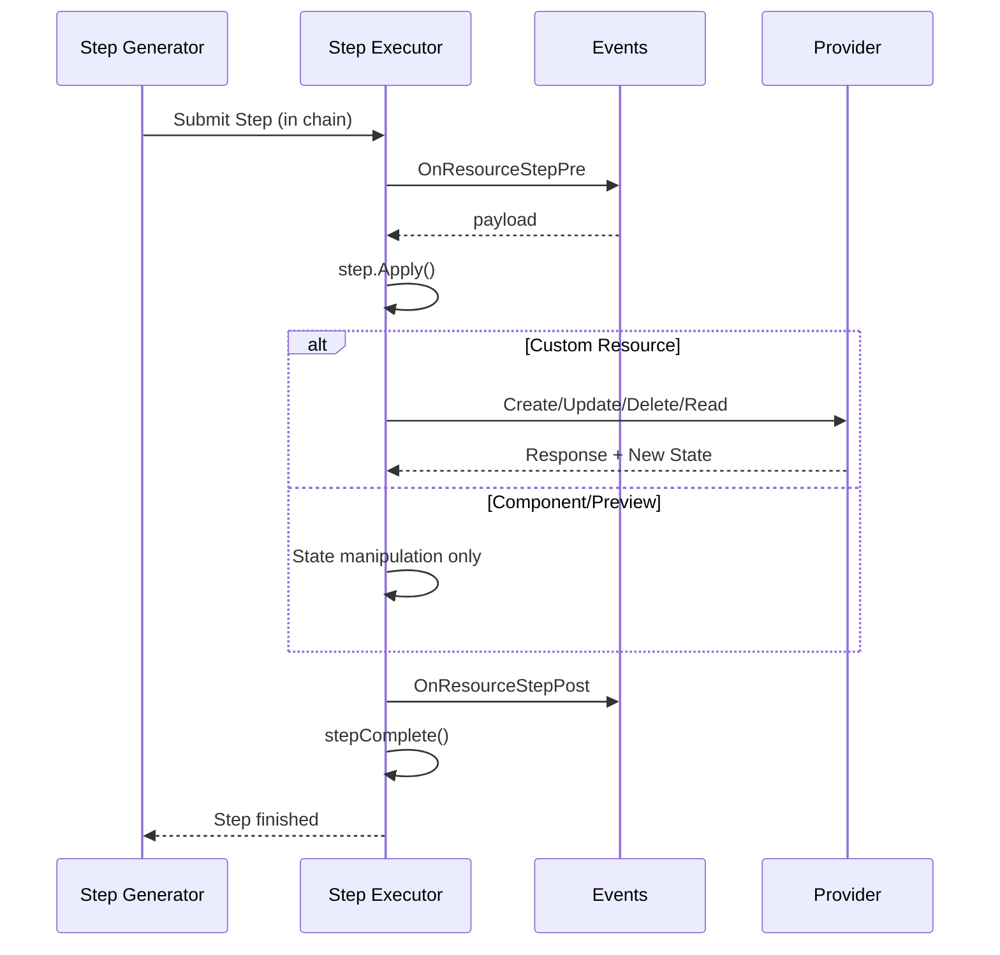

# Deployment Steps

Deployments in Pulumi happens as a series of `Step`s. These are generated by the
[step generator](https://pulumi-developer-docs.readthedocs.io/latest/docs/architecture/deployment-execution/resource-registration.html#step-generation),
and then executed by the deployment executor.

When a [Step](https://pkg.go.dev/github.com/pulumi/pulumi/pkg/v3/resource/deploy#Step) is
applied using the `Apply()` function, it interacts with backing providers to produce the
function that will ultimately register the resource against Pulumi's desired state graph.

Each step also has an old and a new state, the old state representing the state
we read from the snapshot, or the result of a previous step, and the new state
representing the state that the step should have after the `Apply()`.

Pulumi's deployment system uses different step types to represent the various
operations that can be performed on resources. These steps fall into several
categories:

## Step Categories

**Externally Mutating Steps** directly modify resources via provider operations:
- [**CreateStep**](https://pkg.go.dev/github.com/pulumi/pulumi/pkg/v3/resource/deploy#CreateStep): Creates new resources
- [**UpdateStep**](https://pkg.go.dev/github.com/pulumi/pulumi/pkg/v3/resource/deploy#UpdateStep): Updates existing resources
- [**DeleteStep**](https://pkg.go.dev/github.com/pulumi/pulumi/pkg/v3/resource/deploy#DeleteStep): Deletes resources

**Non-Mutating Steps** represent logical operations:
- [**SameStep**](https://pkg.go.dev/github.com/pulumi/pulumi/pkg/v3/resource/deploy#SameStep): Resource unchanged or skipped
- [**ReplaceStep**](https://pkg.go.dev/github.com/pulumi/pulumi/pkg/v3/resource/deploy#ReplaceStep): Logical marker for replacements (combination of Create +
  Delete)

**Special Steps** handle specific scenarios:
- [**ReadStep**](https://pkg.go.dev/github.com/pulumi/pulumi/pkg/v3/resource/deploy#ReadStep): Imports resources as external references
- [**RefreshStep**](https://pkg.go.dev/github.com/pulumi/pulumi/pkg/v3/resource/deploy#RefreshStep): Updates state from provider
- [**ImportStep**](https://pkg.go.dev/github.com/pulumi/pulumi/pkg/v3/resource/deploy#ImportStep): Brings resources under Pulumi management
- [**RemovePendingReplaceStep**](https://pkg.go.dev/github.com/pulumi/pulumi/pkg/v3/resource/deploy#RemovePendingReplaceStep): Cleanup step for pending replacements
- [**DiffStep**](https://pkg.go.dev/github.com/pulumi/pulumi/pkg/v3/resource/deploy#DiffStep): Parallel diff computation (not a real step)
- [**ViewStep**](https://pkg.go.dev/github.com/pulumi/pulumi/pkg/v3/resource/deploy#ViewStep): Virtual step for view resources (display only)

## Step Lifecycle

Each step follows this lifecycle:
1. **Generation**: Step generator creates steps based on resource state and diff
   results
2. **Submission**: Steps are submitted to the step executor in chains (serial
   sequences) or antichains (parallel sets)
3. **Pre-Event**: `OnResourceStepPre` callback fires before execution
4. **Application**: Step's `Apply()` method executes, potentially calling
   provider methods
5. **Post-Event**: `OnResourceStepPost` callback fires after execution
6. **Completion**: Step completion function signals to dependent steps

## Replacement Workflows

Replacements come in two flavors:

### Create-Before-Replace (Default)

The new resource is created first, then the old is deleted. Both resources exist
in state temporarily, with the old marked `Delete = true` after creation. The
`ReplaceStep` is created as a marker after the `CreateStep` is generated.

### Delete-Before-Replace

The old resource is deleted first in the provider, but kept in the snapshot, marked
as `PendingReplacement`. Then the new resource is created, removing the resource
`PendingReplacement` from the state.

## Step Properties

All steps implement the `Step` interface and have:
- **Old()**: State before the step
- **New()**: State after the step
- **Res()**: Latest known state
- **Logical()**: Whether this represents a logical program operation (vs.
  internal bookkeeping)
- **Apply()**: Executes the step, returns status, completion function, and error

## Step Details

### SameStep

`SameStep`s are generated whenever a resource does not change. This can happen
for example if we have an existing resource and the provider `Diff` call returns
no changes, or if there's a targeted `up`, and the resource is not being
targeted.  We also use `SameStep`s for "skipped creates". Those are also emitted
if a resource is not targeted, but is being created by the program.

#### Application

When this type of step is applied, we copy the old inputs to the new inputs, and
complete the step. The completion function will mark the resulting state as the
"new" state.  If the step is skipped, we do no such copying.

### CreateStep

`CreateStep`s are emitted whenever we want to create a new resource.  Note that
there are two variations of create steps, namely a regular create, and a
create-replacement`. The create step simply creates a new resource. A
create-replacement step is generated when we do a replace of a resource. It is
always returned combined with a `ReplaceStep` (see below).

#### Application

During the application of the create step, we first run the `BeforeCreate`
hooks.  Then if we have a custom resource, we call `Create` on the  provider to
actually create the resource. For both Custom and Component resources we then
update the "New" state, and finally call the `AfterCreate` hook once the
resource creation is done.

If we have a create-replacement step, and the old resource is not yet deleted
(i.e. it's not marked deleteBeforeReplace), we also mark the old resource as
`Delete`. This allows us to keep both versions of the resource in the snapshot,
and keep track of the resource that has not yet been deleted from the cloud
provider. Note that this is one of the places where we edit the deployment state
directly instead of through the snapshot manager.

### DeleteStep

`DeleteStep`s are generated when a resource needs to be removed from the
deployment. This includes resources removed from the program, replacements
requiring deletion, or external resource discards.

#### Application

The delete step runs `BeforeDelete` hooks, checks for protection (failing if
protected and not a replacement), and then:
- In preview: synthesizes view steps but doesn't delete
- External resources: no-op (Pulumi doesn't own lifecycle)
- RetainOnDelete: deletion skipped
- DeletedWith: skipped if parent is also being deleted
- Custom resources: calls provider's `Delete` method

For delete-before-replace operations, the `PendingReplacement` flag is set after
successful deletion. `AfterDelete` hooks run immediately for both custom and
component resources (unlike Create/Update which defer component hooks to
`RegisterResourceOutputs`).

### UpdateStep

`UpdateStep`s modify existing resources when the provider indicates changes are
needed that don't require replacement.

#### Application

The update step propagates the resource ID and timestamps, runs `BeforeUpdate`
hooks, then calls the provider's `Update` method with old and new
inputs/outputs. The provider returns updated outputs, and the modified timestamp
is updated. For custom resources, `AfterUpdate` hooks run at completion; for
component resources, they run during `RegisterResourceOutputs`.

### ReplaceStep

`ReplaceStep`s are logical markers indicating a resource replacement. The actual
work happens in the associated `CreateStep` and `DeleteStep`. This step exists
for visualization and tooling purposes.

#### Application

The `Apply` method is essentially a no-op, verifying that pending delete
resources are properly marked for deletion.

### ReadStep

`ReadStep`s import existing resources as external references (marked with the
`External` flag, meaning Pulumi doesn't own their lifecycle).

#### Application

The provider's `Read` method fetches the current cloud state. For
`ReadReplacement` steps, the old managed resource is marked for deletion. Unlike
most steps, Read steps execute during previews to fetch actual state.

### RefreshStep

`RefreshStep`s update resource state by reading current provider state. Note that
these steps can be issued either by the deployment executor or the step generator.

#### Application

Component resources, providers, and pending replacements aren't refreshed. For
custom resources, the provider's `Read` fetches current state. If the provider
returns a blank ID, the resource is considered deleted. A diff is computed
showing changes between provider state and program's desired state (inverted
from normal diff direction). The `ResultOp` method returns whether the resource
is same, updated, or deleted.

### ImportStep

`ImportStep`s bring existing cloud resources under Pulumi management (unlike
`ReadStep`s which create external references).

#### Application

For custom resources, the provider's `Read` method fetches state using the
`ImportID`. An "old" state is synthesized for diff display. For planned imports
(from `pulumi import` command), the resource must not exist in state, and
provider `Check` validates inputs. For import replacements, the original
resource is marked for deletion.

### RemovePendingReplaceStep

`RemovePendingReplaceStep`s clean up the `PendingReplacement` flag set during
delete-before-replace operations.

#### Application

The `Apply` method is a no-op. This step exists for tracking and display
purposes.

### DiffStep

`DiffStep`s leverage the step executor's parallel worker pool for computing
resource diffs during step generation.

#### Application

Calls the provider's `Diff` method and communicates results via a promise
completion source rather than returning errors. Never participates in normal
step error handling.

### ViewStep

`ViewStep`s are virtual steps for [view resources](resources#view-resources). They communicate
what happened to views for display and analysis, but don't perform provider operations.

#### Application

The `Apply` method is mostly a no-op. For `OpCreateReplacement` view steps, it
marks the old resource for deletion. Returns the recorded status and error.
