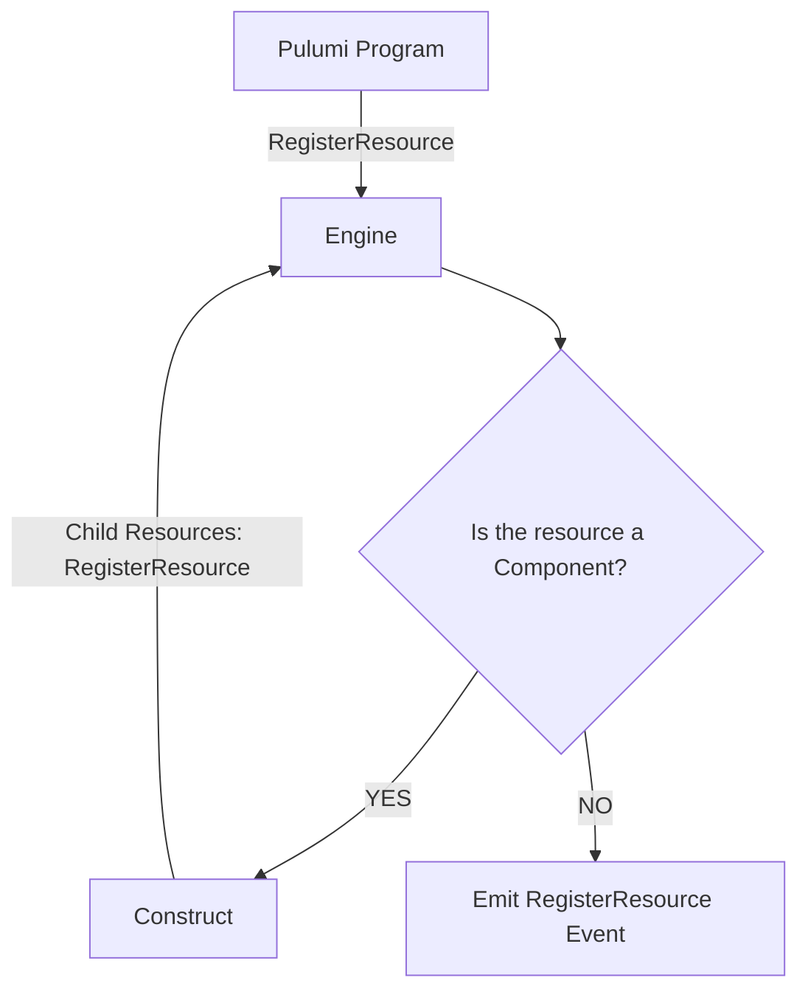

(mlcs)=
(component-providers)=
# Component providers

Authors of Pulumi programs can use [component resources](component-resources) to
logically group related resources together. For instance, a TypeScript program
might specify a component that combines AWS and PostgreSQL providers to abstract
the management of an RDS database and logical databases within it:

```typescript
import * as aws from "@pulumi/aws"
import * as postgresql from "@pulumi/postgresql"

class Database extends pulumi.ComponentResource {
  constructor(name: string, args: DatabaseArgs, opts?: pulumi.ComponentResourceOptions) {
    super("my:database:Database", name, args, opts)

    const rds = new aws.rds.Instance("my-rds", { ... }, { parent: this })
    const pg = new postgresql.Database("my-db", { ... }, { parent: this })

    ...
  }
}
```

This component can then be used just like any other Pulumi resource:

```typescript
const db = new Database("my-db", { ... })
```

...if the program is written in the same language as the component (in this
case, TypeScript). In some cases however it would be great if components could
be reused in multiple languages, since components provide a natural means to
abstract and reuse infrastructure.

Enter *component providers* (also known as *multi-language components*, or
MLCs). Component providers allow components to be written in one language and
used in another (or rather, any other). Typically we refer to such components as
*remote*, in contrast with *local* components written directly in and alongside
the user's program as above.

Under the hood, component providers expose remote components by implementing the
[](pulumirpc.ResourceProvider.Construct) method. The engine automatically calls
`Construct` when it sees a request to create a remote
component.[^engine-construct] Indeed, since providers and gRPC calls are the key
to making custom resources consumable in any language, exposing components
through the same interface is a natural extension of the Pulumi model.

[^engine-construct]:
    See [resource registration](resource-monitor) for more information.

Just as the body of a component resource is largely concerned with instantiating
other resources, so is the implementation of `Construct` for a component
provider. Whereas a custom resource's [](pulumirpc.ResourceProvider.Create)
method can be expected to make a "raw" call to some underlying cloud provider
API (for instance), [](pulumirpc.ResourceProvider.Construct) is generally only
concerned with registering child resources and their desired state. For this
reason, [](pulumirpc.ConstructRequest) includes a `monitorEndpoint` so that the
component provider can itself make
[](pulumirpc.ResourceMonitor.RegisterResource) calls *back* to the [deployment's
resource monitor](resource-monitor) to register these child resources. Child
resources registered by `Construct` consequently end up in the calling program's
state just like any other resource, and proceed through [step
generation](step-generation), etc. in exactly the same way. That is to say, once
`Construct` has been called, the engine does not really care whether or not a
resource registration came from the program or a remote component.



:::{note}
"Ordinary" resource providers and component providers are not mutually exclusive
-- it is perfectly sensible for a provider to implement both the
[](pulumirpc.ResourceProvider.Construct) and
[](pulumirpc.ResourceProvider.Create)/[](pulumirpc.ResourceProvider.Read)/...
methods.
:::
