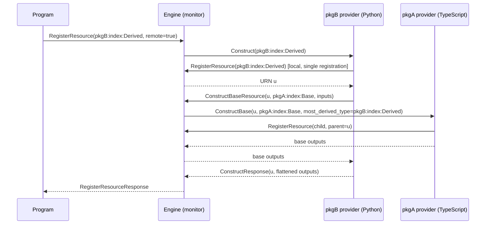

(component-inheritance)=
# Component inheritance

Components can extend other components, including components implemented in a
different language and published in a different package: a base class authored
in TypeScript can be subclassed in Python, that subclass extended again in Go,
and so on, arbitrarily deep. This page is the normative specification for the
feature: the schema encoding, the wire protocol, the negotiation rules, and the
obligations each language SDK must satisfy. SDK implementations outside this
repository (.NET, Java) should implement exactly what is specified here; the
committed comments in `provider.proto` and `resource.proto` are co-normative.

## Semantic model

A derived component is **one resource with one URN**, registered exactly once
under its most-derived type token. Snapshot format, engine events, aliases, and
targeting are unaffected: the state graph cannot distinguish a component built
through an inheritance chain from one whose author wrote everything in a single
class.

Construction proceeds as follows for `pkgB:index:Derived` (Python) extending
`pkgA:index:Base` (TypeScript):

1. The consumer program registers `pkgB:index:Derived` with `remote=true` —
   the ordinary remote-component wire contract, unchanged. The engine
   dispatches  to pkgB's provider.
2. Inside pkgB's provider, the implementation class's constructor chain runs.
   It bottoms out in a single local component registration carrying the
   most-derived token, exactly as [components](component-providers) register
   today. The resource's URN now exists.
3. The generated base-class proxy for `pkgA:index:Base` then calls the new
   monitor method , passing
   the URN, the base type token, and the inputs the derived constructor passed
   to `super()`.
4. The engine resolves pkgA's provider (identical resolution canon to a remote
   construct: package reference or version fields select the package; an
   explicit provider reference, the request's provider map, the providers
   recorded at registration, and the default provider are consulted in that
   order) and invokes the new provider method
   .
5. pkgA's provider runs the base implementation in **attach mode**: the class
   adopts the existing URN — no new registration, no state fetch — its
   constructor body executes normally, resources it creates are parented to
   the adopted URN, and its schema-declared outputs are returned as the
   response state.
6. If the base itself extends a component from yet another package, its own
   generated proxy issues a further `ConstructBaseResource` call. Recursion is
   strictly compositional: each level knows only its immediate base, because
   each level's inputs are computed by the level above it.
7. Outputs unwind level by level: each proxy resolves the returned base
   outputs onto the (single, per-process) live instance, and each provider's
   response state carries its level's full flattened output set.

Same-package `extends` compiles to plain in-language inheritance. No protocol
is involved, and consequently a base-construct chain never legitimately
re-enters the provider process that issued it: any such re-entry is a
type-level cycle.

## Schema encoding

Two fields on `resourceSpec` and one top-level field carry the feature:

* `extends`: an object of the form `{"$ref": "..."}` naming the immediate base
  resource, using the ordinary resource-reference grammar
  (`#/resources/<token>` locally,
  `/<pkg>/v<version>/schema.json#/resources/<token>` across packages).
  Single inheritance only. Both the extender and the target must be components
  (`isComponent: true`); providers and custom resources cannot participate.
* `abstract` (boolean): the component cannot be constructed directly, only
  extended. Requires `isComponent`.
* `requiredFeatures` (top-level, array of string): a schema that is *sparse* —
  that is, one that omits inherited members and relies on the binder to
  materialize them — must include `"inheritance"`. Binders that do not
  recognize a listed feature must reject the schema.

**Published schemas are always flattened.** A derived `resourceSpec` carries
its full transitive member set in `inputProperties`, `properties`, and
`requiredInputs`, exactly as a hand-flattened component would, with `extends`
and `abstract` as additive annotations. This is what makes the encoding safe
for older tooling: the metaschema does not reject unknown resource fields, so
an old CLI binds the flattened view and generates today's standalone flat SDK
— fully functional as a consumer, merely without the type-system relationship.
The sparse form exists only as an authoring convenience between analyzers and
a new CLI; `pulumi package get-schema` normalizes it to the flattened form
before anything is published. The flattened copies double as a lockfile: when
a base package changes incompatibly, rebinding the derived schema produces a
precise diagnostic instead of silent drift.

Methods are never flattened into the spec. Method tokens are same-package by
construction, so a derived spec's `methods` map lists only its own methods; an
entry whose name matches an inherited method is an *override* and must have an
exactly matching signature. Inherited, non-overridden methods surface through
language-level inheritance and dispatch on the base package's function token.

Type-level `extends` cycles are rejected at bind time. Cross-package cycles
cannot arise through well-formed package dependencies (which are acyclic); the
engine's runtime guard (below) is the backstop for cycles introduced by
version skew.

## Wire protocol and negotiation

Two RPCs, both additive. New RPCs are used rather than new fields on existing
messages deliberately: proto3 drops unknown fields silently, so an old server
handed base-construct fields on `Construct` would construct a fresh resource —
silent misbehavior — whereas an unknown RPC fails fast with `UNIMPLEMENTED`.

*  (SDK → engine): carries
  the registered URN, the immediate base type token, inputs (always rich
  output values — both peers are inheritance-aware by construction), input
  dependencies, and package/provider selection fields. The resource must
  already be registered; the engine takes the resource's name from the
  registered goal and never trusts the caller for it. Base-construct requests
  carry **no resource options**: parents, protection, timeouts, and the rest
  are owned by the single most-derived registration.
*  (engine → provider): carries
  the execution context (mirroring `Construct`), the base type to construct,
  the URN to adopt, `most_derived_type` (diagnostics only in v1; reserved for
  future virtual dispatch), inputs, and a provider map for nested resources.

Negotiation is required in both directions, and every failure mode is a clean,
actionable error — never a hang and never partial base state:

* *SDK → engine*: SDKs probe 
  for `RESOURCE_MONITOR_FEATURE_CONSTRUCT_BASE` in `supportedFeatures`. An
  `UNIMPLEMENTED` response or a missing value means the engine is too old; the
  SDK must fail the construction with:
  `component '<derived>' extends '<base>' from another package, which requires
  a newer version of the Pulumi CLI (base construction is not supported by
  this engine)`. The legacy `SupportsFeature` string list is frozen and must
  not be extended for this.
* *Engine → provider*: providers advertise `supports_construct_base` on
   and .
  When the base package's provider does not support it, the engine fails
  before dispatch with:
  `the provider for package '<pkg>' does not support acting as a base class
  for component '<urn>'; upgrade the '<pkg>' provider to a version with
  component inheritance support`. An `UNIMPLEMENTED` RPC response is
  normalized to the same error as a backstop for bypassed gates (for example,
  attached debug providers).
* The engine may be disabled as a whole with the `PULUMI_DISABLE_CONSTRUCT_BASE`
  environment variable, which removes the feature from `supportedFeatures` and
  makes the RPC return `UNIMPLEMENTED`.

The engine additionally enforces, per resource: the URN must name a registered
component (`NOT_FOUND` / `INVALID_ARGUMENT` otherwise); a repeated base type
in the active chain for a URN is a definite cycle (`base construction cycle
detected for resource <urn>: A -> B -> A`); and chain depth is capped at 32.
These checks are deterministic errors, not timeouts — construct duration is
legitimately unbounded, so no wall-clock deadline exists anywhere in the
chain.

During previews with unknown provider configuration, `ConstructBase` returns
empty state and the base's outputs are unknown, mirroring the existing
unconfigured-`Construct` behavior.

## Obligations on SDK implementations

An SDK that supports component inheritance must provide, with whatever local
idiom fits the language:

1. **Attach mode**: a construction path, internal to the SDK and set only by
   its provider host, in which a component adopts a given URN — resolving its
   URN directly with no registration and no state fetch, suppressing
   `RegisterResourceOutputs`, while the constructor body still runs and
   children parent to the adopted URN. Implementation classes must need no
   awareness of the mode: the same class serves direct construction and base
   construction.
2. **A base-construct client helper** used by generated proxies, which: gates
   on the monitor feature (with the pinned error above); awaits the resource's
   URN; serializes inputs with rich output values; calls
   `ConstructBaseResource`; and resolves the returned state onto the live
   instance for exactly the base level's declared output keys, never
   overwriting an output the derived level already resolved.
3. **A `ConstructBase` provider-host handler** that mirrors `Construct`
   (per-request runtime configuration, then the unchanged author-facing
   construct entry point with the attach information threaded internally) and
   returns the level's outputs as response state.
4. **Concurrent, reentrant serving.** Provider hosts must serve `Construct`,
   `ConstructBase`, and `Call` concurrently, with per-request isolation of all
   runtime state (project, stack, config, monitor connection). A chain such as
   TypeScript → Python → TypeScript re-enters the first provider process while
   its original request is still blocked; any per-process serialization of
   requests deadlocks it. This is a hard requirement, verified by reentrancy
   tests in each SDK.
5. **Child-naming stability.** Base levels must not apply any level-specific
   naming, prefixing, or synthetic parents to the resources they register.
   Children parent directly to the adopted URN and derive their URNs from it
   exactly as if the most-derived class had registered them. This guarantees
   that refactoring a monolithic component into a base-plus-derived chain (or
   moving members between levels) produces no replacements on upgrade. The
   converse refactor — turning a *nested child* component into a base class —
   removes a node from the graph and does change child URNs; users must alias
   through that migration.
6. **Ad-hoc local subclassing** of a generated component class (in a user
   program, outside any published package) is defined: it works when the
   subclass declares a static type token (`__pulumiType` in TypeScript,
   `@pulumi.type_token`/`pulumi_type` in Python, and equivalents elsewhere),
   and fails with a clear error directing the user to declare one otherwise.
7. **Abstract enforcement**: generated code prevents direct instantiation
   idiomatically (`abstract class` in TypeScript/.NET/Java, a constructor
   guard in Python, no constructor function in Go), and the provider host
   rejects a direct `Construct` of an abstract token — the host check is the
   source of truth, since old consumer SDKs and Go embedding can bypass the
   language-level guard. `ConstructBase` of an abstract type is always
   permitted.

Method dispatch: inherited, non-overridden methods call with the base
package's function token (and base package reference/version), which the
engine routes to the base provider even though the receiver's URN carries the
derived type. Overridden methods carry derived-owned tokens. Calls a base
implementation makes on itself dispatch in-process in v1; there is no
cross-process virtual dispatch. A consumer SDK generated before an override
was published continues to call the base token until regenerated, consistent
with the flattening posture generally.

## Projections

* **TypeScript**: `class Derived extends base.Service`; args interfaces
  extend; own outputs declared with `declare` (no initializers — an
  initialized field would suppress the base's resolved output); abstract
  classes use `abstract`.
* **Python**: `class Derived(base.Service)`; the type-token decorator doubles
  as the subclass token; abstract enforced by a `type(self)` constructor
  guard (ABCs only block instantiation when abstract methods exist).
* **Go**: the derived struct value-embeds the generated base proxy struct; the
  SDK's resource-state reflection recurses through anonymous embeds; one
  `RegisterComponentResource`/`RegisterRemoteComponentResource` with a fully
  flattened args struct; authors call the generated
  `Construct<Name>Base(ctx, self, args)` helper (which wraps
  `Context.ConstructBase`) immediately after registration; abstract types
  emit no constructor.
* **.NET**: `public class Derived : Base` with `DerivedArgs : BaseArgs`; a
  `protected` constructor overload carries the internal chain state; direct
  construction detected via `GetType() != typeof(Base)`; abstract types are
  `abstract class`es (public constructor omitted, protected chain constructor
  kept).
* **Java**: `public class Derived extends Base`; args classes extend but their
  *builders* are flattened (builders do not usefully inherit; the derived
  builder re-declares base setters); a `protected` chain constructor; direct
  construction detected via `getClass() != Base.class`; abstract types are
  `abstract class`es.

In every language, a concrete base class generated from a schema remains fully
usable standalone, byte-for-byte compatible with its pre-inheritance behavior
when not subclassed.
