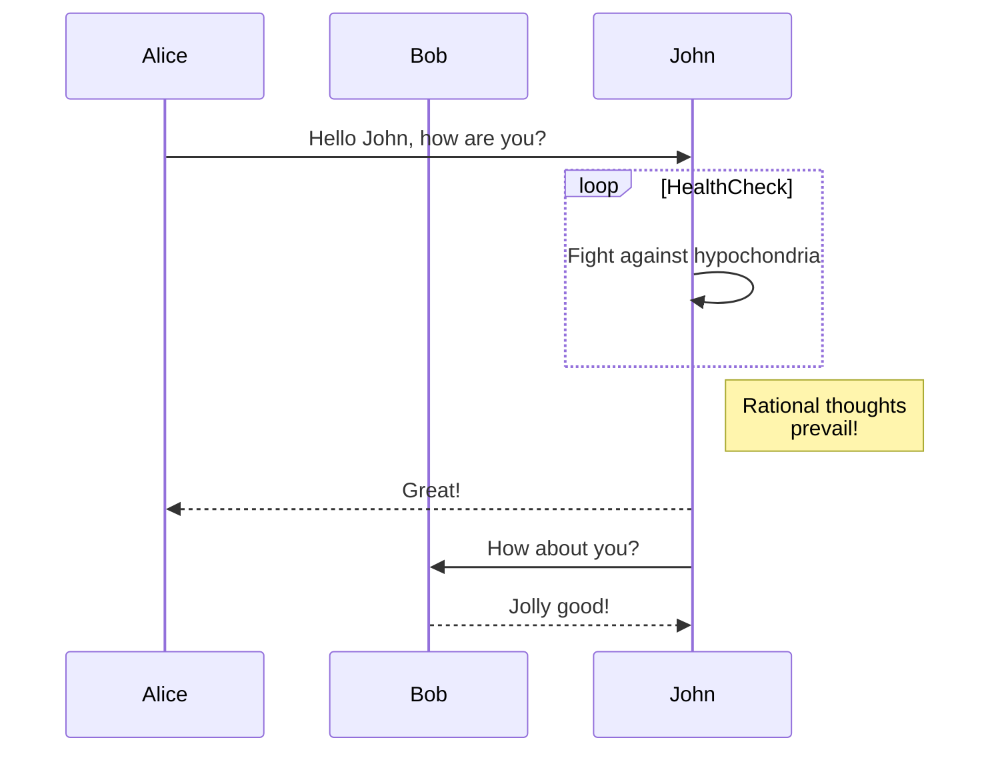
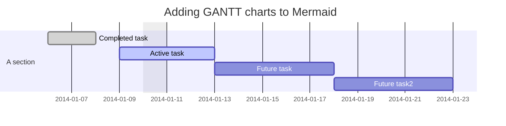
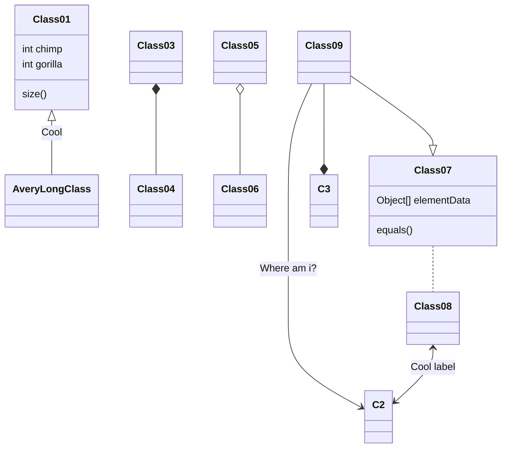
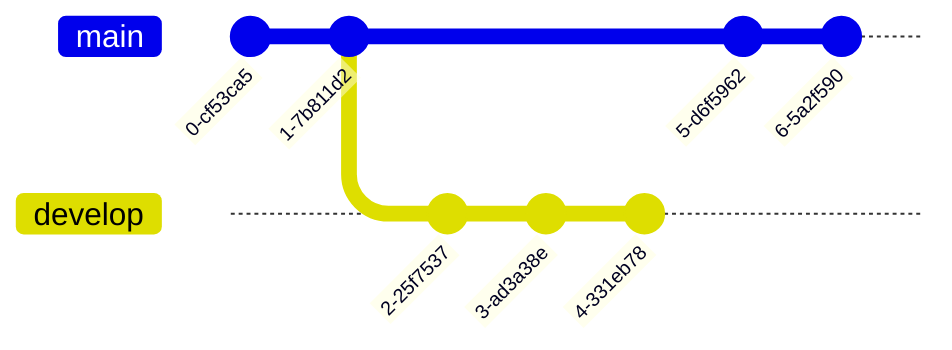
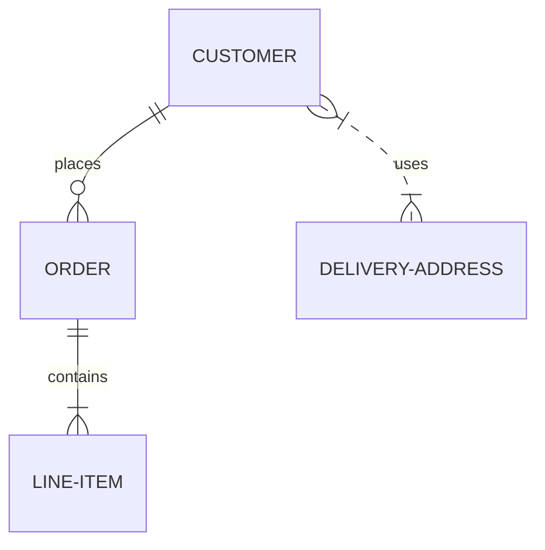
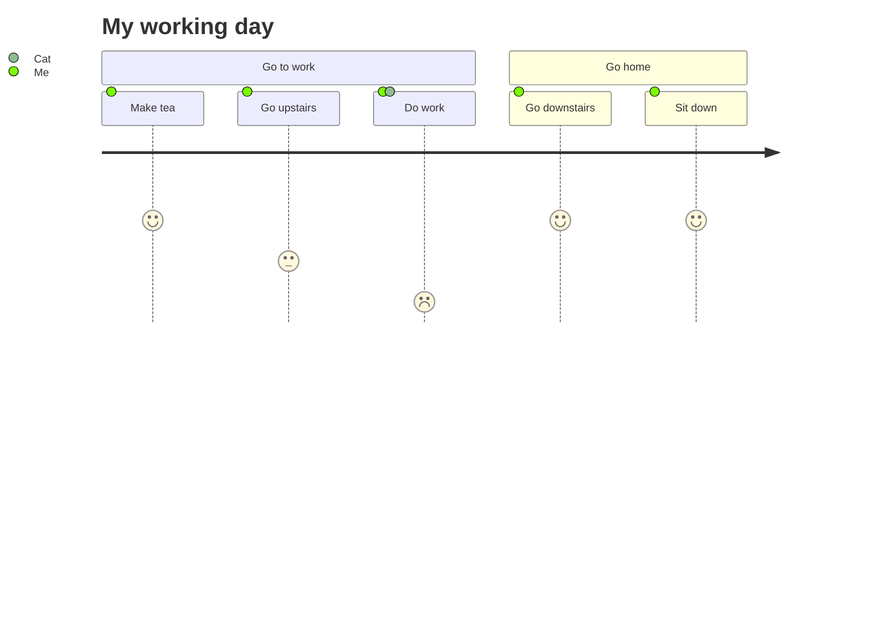

# Diagrams

MyST supports [Mermaid](https://mermaid.js.org) diagrams. Mermaid is a
diagramming and charting tool that renders Markdown-inspired text definitions to
create and modify diagrams dynamically. Use the ```` ```mermaid ```` language
type to create a diagram. This page gives some examples (taken from the official
site at the time of writing) but as always you can find more comprehensive
information in the official documentation.

## Flow charts

````markdown

````


## Sequence diagrams

````markdown

````


## Gantt charts

````markdown

````


## Class diagrams

````markdown

````


## Commit graphs and trees (Git graphs)

````markdown

````



## Entity-relationship (ER) diagrams

````markdown

````


## User journey diagrams

````markdown

````


