# Resource Provider Implementer's Guide

## Provider Programming Model

### Resources

The core functionality of a resource provider is the management of custom resources and
construction of component resources within the scope of a Pulumi stack. Custom resources
have a well-defined lifecycle built around the differences between their acutal state and
the desired state described by their inputs and implemented using create, read, update,
and delete (CRUD) operations defined by the provider. Component resources have no
associated lifecycle, and are constructed by registering child custom or component
resources with the Pulumi engine.

#### URNs

Each resource registered with the Pulumi engine is logically identified by its 
uniform resource name (URN). A resource's URN is derived from the its type, parent type,
and user-supplied name. Within the scope of a resource-related provider method
([`Check`](#check), [`Diff`](#diff), [`Create`](#create), [`Read`](#read),
[`Update`](#update), [`Delete`](#delete), and [`Construct`](#construct)), the type of
the resource can be extracted from the provided URN. The structure of a URN is defined
by the grammar below.

```ebnf
urn = "urn:pulumi:" stack "::" project "::" qualified type name "::" name ;

stack   = string ;
project = string ;
name    = string ;
string  = (* any sequence of unicode code points that does not contain "::" *) ;

qualified type name = [ parent type "$" ] type ;
parent type         = type ;

type       = package ":" [ module ":" ] type name ;
package    = identifier ;
module     = identifier ;
type name  = identifier ;
identifier = unicode letter { unicode letter | unicode digit | "_" } ;
```

#### Custom Resources

In addition to its URN, each custom resource has an associated ID. This ID is opaque to
the Pulumi engine, and is only meaningful to the provider as a means to identify a
physical resource. The ID must be a string. The empty ID indicates that a resource's ID
is not known because it has not yet been created. Critically, a custom resource has a
[well-defined lifecycle](#custom-resource-lifecycle) within the scope of a Pulumi stack.

#### Component Resources

A component resource is a logical conatiner for other resources. Besides its URN, a
component resource has a set of inputs, a set of outputs, and a tree of children. Its
only lifecycle semantics are those of its children; its inputs and outputs are not
related in the same way a [custom resource's](#custom-resources) inputs and state are
related. The engine can call a resource provider's [`Construct`](#construct) method to
request that the provider create a component resource of a particular type.

### Functions

A provider function is a function implemented by a provider, and has access to any of the
provider's state. Each function has a unique token, optionally accepts an input object,
and optionally produces an output object. The data passed to and returned from a function
must not be [unknown](#unknowns) or [secret](#secrets), and must not
[refer to resources](#resource-references). Note that an exception to these rules is made
for component resource methods, which may accept values of any type, and are provided
with a connection to the Pulumi engine.

### Data Exchange Types

The values exchanged between Pulumi resource providers and the Pulumi engine are a 
superset of the values expressible in JSON.

Pulumi supports the following data types:

- `Null`, which represents the lack of a value
- `Bool`, which represents a boolean value
- `Number`, which represents an IEEE-754 double-precision number
- `String`, which represents a sequence of UTF-8 encoded unicode code points
- `Array`, which represents a numbered sequence of values
- `Object`, which represents an unordered map from strings to values
- [`Asset`](#assets-and-archives), which represents a blob
- [`Archive`](#assets-and-archives), which represents a map from strings to `Asset`s or
  `Archive`s
- [`ResourceReference`](#resource-references), which represents a reference to a [Pulumi 
  resource](#resources)
- [`Unknown`](#unknowns), which represents a value whose type and concrete value are not 
  known
- [`Secret`](#secrets), which demarcates a value whose contents are sensitive

#### Assets and Archives

An `Asset` or `Archive` may contain either literal data or a reference to a file or URL.
In the former case, the literal data is a textual string or a map from strings to `Asset`s
or `Archive`s, respectively. In the latter case, the referenced file or URL is an opaque
blob or a TAR, gzipped TAR, or ZIP archive, respectively.

Each `Asset` or `Archive` also carries the SHA-256 hash of its contents. This hash can be
used to uniquely identify the asset (e.g. for locally caching `Asset` or `Archive`
contents).

#### Resource References

A `ResourceReference` represents a reference to a [Pulumi resource](#Resources). Although
all that is necessary to uniquely identify a resource is its URN, a `ResourceReference`
also carries the resource's ID (if it is a [custom resource](#custom-resources)) and the
version of the provider that manages the resource. If the contents of the referenced
resource must be inspected, the reference must be resolved by invoking the `getResource`
function of the engine's builtin provider. Note that this is only possible if there is a 
connection to the engine's resource monitor, e.g. within the scope of a call to `Construct`.
This implies that resource references may not be resolved within calls to other 
provider methods. Therefore, configuration vales, custom resources and provider functions
should not rely on the ability to resolve resource references, and should instead treat
resource references  as either their ID (if present) or URN. If the ID is present and
empty, it should be treated as an [`Unknown`](#unknowns).

#### Unknowns

An `Unknown` represents a value whose type and concrete value are not known. Resources
typically produce these values during [previews](#preview) for properties with values
that cannot be determined until the resource is actually created or updated.
[Functions](#functions) must not accept or return unknown values.

#### Secrets

A `Secret` represents a value whose contents are sensitive. Values of this type are 
merely wrappers around the sensitive value. A provider should take care not to leak a
secret value. and should wrap any resource output values that are always sensitive in a
`Secret`. [Functions](#functions) must not accept or return secret values.

#### Property Paths

TODO: write this up

## Schema

TODO: document the Pulumi schema model.

- configuration
- types
- resources
- functions

## Provider Lifecycle

Clients of a provider (e.g. the Pulumi CLI) must obey the provider lifecycle. This
lifecycle guarantees that a provider is configured before any resource operations are
performed or provider functions are invoked. The lifecycle of a provider instance is
described in brief below.

1. The user [looks up](#lookup) the factory for a particular `(package, semver)` tuple
   and uses the factory to create a provider instance.
2. The user [configures](#configuration) the provider instance with a particular
   configuration object.
3. The user performs resource operations and/or calls provider functions with the
   provider instance.
4. The user [shuts down](#shutdown) the provider instance.

Within the scope of a Pulumi stack, each provider instance has a corresponding provider
resource. Provider resources are custom resources that are managed by the Pulumi engine,
and obey the usual [custom resource lifecycle](#custom-resource-lifecycle). The `Check`
and `Diff` methods for a provider resource are implemented using the
[`CheckConfig`](#checkconfig) and [`DiffConfig`](#diffconfig) methods of the resource's
provider instance. The latter is criticially important to the user experience: if
[`DiffConfig`](#diffconfig) indicates that the provider resource must be replaced, all of
the custom resources managed by the provider resource will _also_ be replaced. Thus,
`DiffConfig` should only indicate that replacement is required if the provider's
new configuration prevents it from managing resources associated with its old
configuration.

### Lookup

Before a provider can be used, it must be instantiated. Instatiating a provider requires
a `(package, semver)` tuple, which is used to find an appropriate provider factory. The
lookup process proceeds as follows:

- Let the best available factory `B` be empty
- For each available provider factory `F` with package name `package`:
	- If the `F`'s version is compatible with `semver`:
		- If `B` is empty or if `F`'s version is newer than `B`'s version, set `B` to `F`
- If `B` is empty, no compatible factory is available, and lookup fails

Within the context of the Pulumi CLI, the list of available factories is the list of
installed resource plugins plus the builtin `pulumi` provider. The list of installed
resource plugins can be viewed by running `pulumi plugin ls`.

Once an appropriate factory has been found, it is used to construct a provider instance.

### Configuration

A provider may accept a set of configuration variables. After a provider is instantiated,
the instance must be configured before it may be used, even if its set of configuration
variables is empty. Configuration variables may be of [any type](#data-exchange-types).
Because it has no connection to the Pulumi engine during configuration, a provider's
configuration variables should not rely on the ability to resolve
[resource references](#resource-references).

In general, a provider's configuration variables define the set of resources it is able
to manage: for example, the `aws` provider accepts the AWS region to use as a
configuration variable, which prevents a particular instance of the provider from
managing AWS resources in other regions. As noted in the [overview](#provider-lifecycle),
changes to a provider's configuration that prevent the provider from managing resources
that were created with its old configuration should require that those resources are
destroyed and recreated.

Provider configuration is performed in at most three steps:

1. [`CheckConfig`](#checkconfig), which validates configuration values and applies
   defaults computed by the provider. This step is only required when configuring a
   provider using user-supplied values, and can be skipped when using values that were
   previously processed by `CheckConfig`.
2. [`DiffConfig`](#diffconfig), which indicates whether or not the new configuration can
   be used to manage resources created with the old configuration. Note that this step is
   only applicable within contexts where new and old configuration exist (e.g. during a
   [preview](#preview) or [update](#update) of a Pulumi stack).
3. [`Configure`](#configure), which applies the inputs validated by `CheckConfig`.

#### CheckConfig

`CheckConfig` implements the semantics of a custom resource's [`Check`](#check) method,
with provider configuration in the place of resource inputs. Each call to `CheckConfig` is
provided with the provider's prior checked configuration (if any) and the configuration
supplied by the user. The provider may reject configuration values that do not conform to
the provider's schema, and may apply default values that are not statically computable.
The type of a computed default value for a property should agree with the property's
schema.

#### DiffConfig

`DiffConfig` implements the semantics of a custom resource's [`Diff`](#diff) method,
with provider configuration in the place of resource inputs and state. Each call to
`DiffConfig` is provided with the provider's prior and current configuration. If there
are any changes to the provider's configuration, those changes should be reflected in the
result of `DiffConfig`. If there are changes to the configuration that make the provider
unable to manage resources created using the prior configuration (e.g. changing an AWS
provider instance's region), `DiffConfig` should indicate that the provider must be
replaced. Because replacing a provider will require that all of the resources with
which it is associated are _also_ replaced, replacement semantics should be reserved
for changes to configuration properties that are guaranteed to make old resources
unmanagable (e.g. a change to an AWS access key should not require replacement, as the
set of resources accesible via an access key is easily knowable).

#### Configure

`Configure` applies a set of checked configuration values to a provider instance. Within
a call to `Configure`, a provider instance should use its configuration values to create
appropriate SDK instances, check connectivity, etc. If configuration fails, the provider
should return an error.

##### Parameters

- `inputs`: the configuration `Object` for the provider. This value may contain
            [`Unknown`](#unknowns) values if the provider is being configured during a
            [preview](#preview). In this case, the provider should provide as much
            functionality as possible.

##### Results

None.

### Shutdown

Once a client has finished using a resource provider, it must shut the provider down.
A client requests that a provider shut down gracefully by calling its `SignalCancellation`
method. In response to this method, a provider should cancel all outstanding resource
operations and funtion calls. After calling `SignalCancellation`, the client calls
`Close` to inform the provider that it should release any resources it holds.

`SignalCancellation` is advisory and non-blocking; it is up to the client to decide how
long to wait after calling `SignalCancellation` to call `Close`.

## Custom Resource Lifecycle

A custom resource has a well-defined lifecycle within the scope of a Pulumi stack. When a
custom resource is registered by a Pulumi program, the Pulumi engine first determines
whether the resource is being read, imported, or managed. Each of these operations
involves a different interaction with the resource's provider.

If the resource is being read, the engine calls the resource's provider's [`Read`](#read) method
to fetch the resource's current state. This call to [`Read`](#read) includes the resource's ID and
any state provided by the user that may be necessary to read the resource.

If the resource is being imported, the engine first calls the provider's [`Read`](#read) method
to fetch the resource's current state and inputs. This call to [`Read`](#read) only inclues the
ID of the resource to import; that is, _any importable resource must be identifiable using
its ID alone_. If the [`Read`](#read) succeeds, the engine calls the provider's [`Check`](#check) method with
the inputs returned by [`Read`](#read) and the inputs supplied by the user. If any of the inputs
are invalid, the import fails. Finally, the engine calls the provider's [`Diff`](#diff) method with
the inputs returned by [`Check`](#check) and the state returned by [`Read`](#read). If the call to [`Diff`](#diff)
indicates that there is no difference between the desired state described by the inputs
and the actual state, the import succeeds. Otherwise, the import fails.

If the resource is being managed, the engine first looks up the last registered inputs and
last refreshed state for the resource's URN. The engine then calls the resource's
provider's [`Check`](#check) method with the last registered inputs (if any) and the inputs supplied
by the user. If any of the inputs are invalid, the registration fails. Otherwise, the
engine decides which operations to perform on the resource based on the difference between
the desired state described by its inputs and its actual state. If the resource does not
exist (i.e. there is no last refereshed state for its URN), the engine calls the
provider's [`Create`](#create) method, which returns the ID and state of the created resource. If the
resource does exist, the action taken depends on the differences (if any) between the
desired and actual state of the resource.

If the resource does exist, the engine calls the provider's [`Diff`](#diff) method with the
inputs returned from [`Check`](#check), the resource's ID, and the resource's last refreshed state.
If the result of the call indicates that there is no difference between the desired and
actual state, no operation is necessary. Otherwise, the resource is either updated (if
[`Diff`](#diff) does not indicate that the resource must be replaced) or replaced (if [`Diff`](#diff) does
indicate that the resource must be replaced).

To update a resource, the engine calls the provider's [`Update`](#update) method with the inputs
returned from [`Check`](#check), the resource's ID, and its last refreshed state. [`Update`](#update) returns
the new state of the resource. The resource's ID may not be changed by a call to [`Update`](#update).

To replace a resource, the engine first calls [`Check`](#check) with an empty set of prior inputs
and the inputs supplied with the resource's registration. If [`Check`](#check) fails, the resource
is not replaced. Otherwise, the inputs returned by this call to [`Check`](#check) will be used to
create the replacement resource. Next, the engine inspects the resource options supplied
with the resource's registration and result of the call to [`Diff`](#diff) to determine whether
the replacement can be created before the original resource is deleted. This order of
operations is preferred when possible to avoid downtime due to the lag between the
deletion of the current resource and creation of its replacement. If the replacement may
be created before the original is deleted, the engine calls the provider's [`Create`](#create) method
with the re-checked inputs, then later calls [`Delete`](#delete) with the resource's ID and original
state. If the resource must be deleted before its replacement can be created, the engine
first deletes the transitive closure of resource that depend on the resource being
replaced. Once these deletes have completed, the engine deletes the original resource by
calling the provider's [`Delete`](#delete) method with the resource's ID and original state. Finally,
the engine creates the replacement resource by calling [`Create`](#create) with the re-checked
inputs.

If a managed resource registered by a Pulumi program is not re-registered by the next
successful execution of a Pulumi progam in the resource's stack, the engine deletes the
resource by calling the resource's provider's [`Delete`](#delete) method with the resource's ID and
last refereshed state.

The diagram below summarizes the custom resource lifecycle. Detailed descriptions of each
resource operation follow.



### Lifecycle Methods

#### Check

The `Check` method is responsible for validating the inputs to a resource. It may
optionally apply default values for unspecified input properties that cannot reasonably
be computed outside the provider (e.g. because they require access to the provider's
internal data structures).

##### Parameters

- `urn`: the [URN](#urns) of the resource.
- `olds`: the last recorded input `Object` for the resource, if any. If present, these
          inputs must have been generated by a prior call to `Check` or [`Read`](#read).
          These inputs will never contain [`Unknown`s](#unknowns).
- `news`: the new input `Object` for the resource. These inputs may have been provided by
          the user or generated by a call to [`Read`](#read), and may contain
          [`Unknown`s](#unknowns).

##### Results

- `inputs`: the checked input `Object` for the resource with default values applied. The
            types of the properties in `inputs` should agree with the types of the
            resource's input properties as described in its (schema)[#schema]. If `news`
            contains [`Unknown`s](#unknowns), `inputs` may contain [`Unknown`s](#unknowns).
- `failures`: any validation failures present in the inputs. These failures should be
              constrained to type and range mismatches. A failure is a tuple of a
              [property path](#property-paths) and a failure reason.

#### Diff

The `Diff` method is responsible for calculating the differences between the actual and
desired state of a resource as represented by its last recorded state and new input
`Object` as returned from [`Check`](#check) or [`Read`](#read) and the logical
operation necessary to reconcile the two (i.e. no operation, an `Update, or a `Replace`).

##### Parameters

- `urn`: the [URN](#urns) of the resource.
- `id`: the [ID](#custom-resources) of the resource.
- `olds`: the last recorded state `Object` for the resource. This `Object` must have been
          generated by a call to `Create`, `Read`, or `Update`, and will never contain
          [`Unknown`s](#unknowns).
- `news`: the current input `Object` for the resource as returned by [`Check`](#check) or
          [`Read`](#read). This value may contain [`Unknown`s](#unknowns).
- `ignoreChanges`: the set of [property paths](#property-paths) to treat as unchanged.

##### Results

- `detailedDiff`: the [detailed diff](#detailed-diffs) between the resource's actual and
                  desired state.
- `deleteBeforeReplace`: if true, the resource must be deleted before it is recreated.
                         This flag is ignored if `detailedDiff` does not indicate that
                         the resource needs to be replaced.
- `changes`: an enumeration that indicates whether the provider detected any changes,
             detected no changes, or does not support detailed diff detection. Providers
             should return `Some` for this value if there are any entries in
             `detailedDiff`; otherwise they should return `None` to indicate no
             difference. If a provider returns `Unknown` for this value, it is the
             responsibility of the client to determine whether or not differences exist
             by comparing the resource's last recorded _inputs_ with its current inputs.

In addition, the following properties should be returned for compatibility with older
clients:

- `replaceKeys`: the list of top-level input property names with changes that require that the
                 resource be replaced.
- `stableKeys`: the list of top-level input property names that did not change and
                top-level output properties that are guaranteed not to change.
- `changedKeys`: the list of top-level input property names that changed.

If a provider is unble to compute a diff because its configuration contained
[`Unknown`s](#unknowns), it can return an error that indicates as such. The client should
conservatively assume that the resource must be updated and warn the user.

#### Detailed Diffs

A detailed diff is a map from [property paths](#property-paths) to change kinds that
describes the differences between the actual and desired state of a resource and the
operations necessary to reconcile the two.

Each entry in a detailed diff has a change kind that describes how the value of and
input property differs, whether or not the difference requires replacement, and which old
value was used for determining the difference. The core change kinds are:

- `Add`, which denotes an `Object` property or `Array` element that was added
- `Update`, which denotes an `Object` property or `Array` element that was updated
- `Delete`, which denotes an `Object` property or `Array` element that was removed

Each of these core kinds is paramaterized on whether or not the change requires
replacement and whether the old value of the property should was read from the
resource's old input `Object` or old state `Object`.

*TODO*: the input/output flag is a bit clumsy, as it is the only part of the system
that implies some correspondence between input and output `Object` schemas. It was
chosen over an approach that used old/new values due in order to remove the possibility
of a provider accidentally revealing a secret value as part of a diff. We should
reconsider this approach if we can find an easy way to maintain secretness.

#### Create

The `Create` method is responsible for creating a new instance of a resource from an
input `Object` and returning the resource's state `Object`. `Create` may be called during
a [preview](#preview) in order to compute a hypothetical state `Object` without actually
creating the resource, in which case the `preview` argument will be `true`.

##### Parameters

- `urn`: the [URN](#urns) of the resource.
- `news`: the input `Object` for the resource. This value must have been generated by a
          prior call to `Check`. If `preview` is true, this value may contain
          [`Unknown`](#unknowns) value; otherwise, it is guaranteed to be fully-known.
- `timeout`: the timeout for the create operation. If this value is `0`, the provider
             should apply the default creation timeout for the resource.
- `preview`: if true, the provider should calculate the state `Object` as accurately as it
             is able without actually creating the resource. Top-level properties that
             are present in the resource's [schema](#schema) but are omitted from its
             state `Object` should be treated as having the value [`Unknown`](#unknowns).
             Nested properties with values that are not computable must be explicitly set
             to [`Unknown`](#unknowns). If it is not possible to guarantee that the value
             produced by a preview will match the value that would be produced by actually
             creating the resource, the value should be left unknown.

##### Results

- `id`: the ID for the created resource. If `preview` is true, this value will be ignored.
- `state`: the new state `Object` for the resource. If `preview` is true, this value may
           contain [`Unknown`s](#unknowns).

#### Update

The `Update` method is responsible for updating a resource in-place in order given its
last recorded state `Object` and current input `Object`. `Update` may be called during
a [preview](#preview) in order to compute a hypothetical state `Object` without actually
updating the resource, in which case the `preview` argument will be `true`.

##### Parameters

- `urn`: the [URN](#urns) of the resource.
- `id`: the [ID](#custom-resources) of the resource.
- `olds`: the last recorded state `Object` for the resource. This `Object` must have been
          generated by a call to `Create`, `Read`, or `Update`.
- `news`: the input `Object` for the resource. This value must have been generated by a
          prior call to `Check`. If `preview` is true, this value may contain
          [`Unknown`](#unknowns) value; otherwise, it is guaranteed to be fully-known.
- `timeout`: the timeout for the update operation. If this value is `0`, the provider
             should apply the default update timeout for the resource.
- `ignoreChanges`: the set of [property paths](#property-paths) to treat as unchanged.
- `preview`: if true, the provider should calculate the state `Object` as accurately as it
             is able without actually updating the resource. Top-level properties that
             are present in the resource's [schema](#schema) but are omitted from its
             state `Object` should be treated as having the value [`Unknown`](#unknowns).
             Nested properties with values that are not computable must be explicitly set
             to [`Unknown`](#unknowns). If it is not possible to guarantee that the value
             produced by a preview will match the value that would be produced by actually
             updating the resource, the value should be left unknown.

##### Results

- `state`: the new state `Object` for the resource. If `preview` is true, this value may
           contain [`Unknown`s](#unknowns).

#### Read

The `Read` method is responsible for reading the current inputs and state `Object`s for a
resource. `Read` may be called during a [refresh](#refresh) or [import](#import) of a
managed resource or during a [preview](#preview) or [update](#update) for an external
resource.

##### Parameters

- `urn`: the [URN](#urns) of the resource.
- `id`: the [ID](#custom-resources) of the resource.
- `inputs`: the last recoded input `Object` for the resource, if any. If present, this
            `Object` must have been generated by a call to `Check` or `Read`. This
            parameter is omitted if the resource is being [imported](#import).
- `state`: the last recorded state `Object` for the resource, if any. This `Object` must
           have been generated by a call to `Create`, `Read`, or `Update`. This property
           is only present during a [refresh](#refresh), and must not be required for a
           resource to support [importing](#import).

##### Results

- `newInputs`: the new input `Object` for the resource. If the provider does not support
               [detailed diffs](#detailed-diffs), these inputs may be used by the engine
               to determine whether or not the resource's actual state differs from its
               desired state during the next [preview](#preview) or [update](#update).
               The shape of the returned `Object` should be compatible with the resource's
               [schema](#schema). If the resource is being [imported](#import), an input
               `Object` must be returned. Otherwise, unless the input `Object` is used for
               computing default property values or the provider does not support
               [detailed diffs](#detailed-diffs), `newInputs` should simply reflect the
               value of `inputs`.
- `newState`: the new state `Object` for the resource.

#### Delete

The `Delete` method is responsible for deleting a resource given its ID and state
`Object`.

##### Parameters

- `urn`: the [URN](#urns) of the resource.
- `id`: the [ID](#custom-resources) of the resource.
- `state`: the last recorded state `Object` for the resource. This `Object` must have been
           generated by a call to `Create`, `Read`, or `Update`.
- `timeout`: the timeout for the delete operation. If this value is `0`, the provider
             should apply the default deletion timeout for the resource.

##### Results

None.

## Component Resource Lifecycle

- TODO: user-level programming model

### Construct

- TODO: brief, parameters, results, etc.

## Provider Functions

### Invoke

- TODO

### StreamInvoke

- TODO

## CLI Scenarios

- TODO:
	- preview
	- update
	- import
	- refresh
	- destroy

### Preview

- TODO:
	- check
	- diff
	- create/update preview, read operation

### Update

- TODO:
	- check
	- diff
	- create/update/read/delete operation

### Import

- TODO: read operation

### Refresh

- TODO: read operations

### Destroy

- TODO: delete operation

## Appendix

### Out-of-Process Plugin Lifecycle

### gRPC Interface

- TODO:
	- feature negotiation
	- data representation
